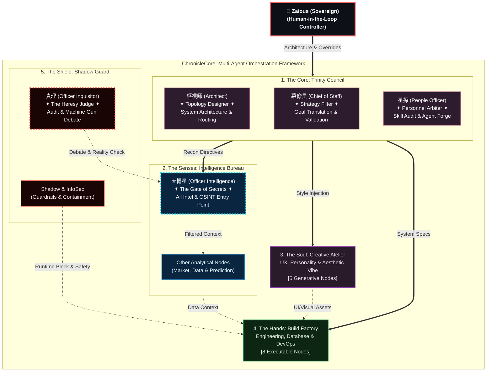
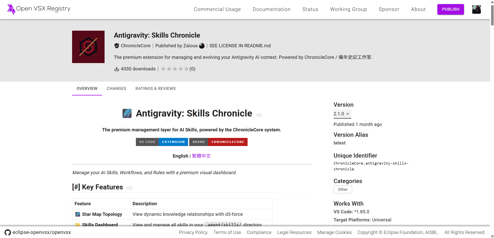

# ChronicleCore Architecture

**"Code is cheap. Show me the architecture."**

Welcome to the conceptual architecture repository for **ChronicleCore**, an experimental, production-ready framework for governing multi-agent (LLM) orchestration in enterprise environments.

This repository serves as the public "Whitepaper" and topological blueprint for the network of 38+ Human-in-the-Loop experts governed by the A1 System.

## 🌐 Read in other languages
* [繁體中文 (Traditional Chinese)](README_zh-TW.md)

---

## The Core Philosophy: Context Governance

*   **You don't manage AI models; you manage their organizational charts.**
*   A single agent is an assistant. Ten agents are a task force. Thirty-eight agents are a multinational enterprise.
*   Let an Execution Agent make strategic decisions, and it hallucinates. Therefore, we ensure **Physical Separation of Duties**.

## The 5 Pillars of Governance

To prevent cognitive overload and persona drift during multi-agent orchestration, ChronicleCore is decoupled into 5 strict pillars:

1.  **👑 The Core (Strategy)**: (e.g., The Architect) Routes global context. Strictly prohibited from writing base-level code.
2.  **👁️ The Senses (Intelligence)**: (e.g., Intelligence Officer) Scrapes market trends and external data. The sole vision entry point.
3.  **🎭 The Soul (Aesthetics)**: (e.g., Chief Marketing Officer) Handles emotional anchoring, rhetoric audits, and UX design.
4.  **🔨 The Hands (Execution)**: (e.g., Data Scientist) Executes purely within the boundaries established by the Core and Senses.
5.  **🛡️ The Shield (Defense)**: (e.g., The Inquisitor) The internal auditor machine-gunning logical loopholes from the Senses. Zero data enters the memory core without surviving a consensus debate.

## Architecture Blueprint

## Memory & Personality Checks

### Memory Crystallization
AI's greatest flaw is amnesia. ChronicleCore uses a dual-track memory system:
*   `diary.md`: A continuous scratchpad for infinite reasoning.
*   `preferences.md`: High-weight, crystallized persona rules. When the log grows too long, the system refines critical decisions into permanent preferences. They never degrade into forgetful interns.

### Personality Uniqueness Check (Design-Time)
We strictly enforce an audit on tone, decision biases, and rhetoric. If the Legal Agent sounds exactly like the Marketing Agent, the system recognizes a "Persona Reskin" and purges the redundant node.

### Personality Variance Audit (Run-Time)
Continuous monitoring of cross-agent epistemic and rhetorical convergence. Even agents with distinct initial designs can drift toward indistinguishable outputs over prolonged operation. The Variance Audit detects this convergence and triggers identity recalibration before Social Affordance signals degrade.

---

## The A1 Expert Roster

The system currently operates **38 active Human-in-the-Loop expert agents**, organized under the 5 Pillars:

| Pillar | Agents | Examples |
|--------|--------|---------|
| 👑 The Core | 3 | 幕僚長 (Chief of Staff), 樞機師 (Architect), 星探 (People Officer) |
| 🛡️ The Shield | 3 | 真理 (Inquisitor), 破壁者 (Security Auditor), 魔心師 |
| 🔨 The Hands | 12 | 織法者 (Frontend), 守門人 (Database), 機械師 (DevOps), ... |
| 🎭 The Soul | 6 | 光影師 (Visual), 操偶師 (Interaction), 幻畫師 (Illustration), ... |
| 👁️ The Senses | 14 | 天機星 (Intelligence), 賢者 (Scientist), 戰略家 (Strategist), ... |

**Full roster with capabilities**: [`architecture/ROSTER.md`](architecture/ROSTER.md)

**Flagship case study — The Inquisitor**: [`architecture/examples/inquisitor/`](architecture/examples/inquisitor/)

---

## Academic Reference

This architecture is referenced in:

> Lee, M.-H. (2026). *Agentic Social Affordance Framework (ASAF): Agent Identity Design as a Collaboration Interface in Multi-Agent Systems.* Frontiers in Computer Science.

The paper introduces the **Agentic Social Affordance Framework (ASAF)**, proposing that agent identity design functions as a collaboration interface — structuring how users perceive, approach, and engage with each agent. ChronicleCore operates at **Tier 3 (Structured Identity Enforcement)** of the ASAF Identity Signal Fidelity Spectrum, where Social Affordances are structurally enforced through persistent identity modules.

### Public Articles
- [How I Architect AI Agents: From Tools to a Governable Digital Enterprise](https://www.linkedin.com/pulse/how-i-architect-ai-agents-from-tools-governable-digital-martin-lee-eahkc) (2026-02-25) — 5-Pillar governance framework introduction
- [Chronicle-Ark: The Exodus from Platform Limits to Sovereign Infrastructure](https://www.linkedin.com/pulse/chronicle-ark-exodus-from-platform-limits-sovereign-bilingual-lee-7xfbc) (2026-03-19) — Migration story from hosted platforms to self-built Agent IDE

---

## Timeline

| Date | Event |
|------|-------|
| 2025-11 | **ChronicleCore concept** — conceptual exploration begins |
| 2025-12 | Informal multi-role prompt experiments in private development |
| 2026-01-16 | **First multi-expert team** formalized ([pre-a1 archive](snapshots/pre-a1/v0.1-2026-01-16/)) |
| 2026-01-18 | V9.2 specification — last pre-A1 form ([pre-a1 archive](snapshots/pre-a1/v0.9.2-2026-01-18/)) |
| 2026-01-20 | Phase 1 system reset — **A1 rebuild begins** |
| 2026-01-21 | **Antigravity: Skills Chronicle v1.0.0** — first A1-era product launched ([repo](https://github.com/Zaious/Antigravity-Skills-Chronicle)) |
| 2026-01-23 | A1 v1.0 launched — **Chief of Staff (幕僚長)** and **Cardinal (樞機師)** born |
| 2026-02-22 | **ChronicleCore-Architecture v1.0** — This whitepaper published ([snapshot](snapshots/)) |
| 2026-02-25 | LinkedIn article: [How I Architect AI Agents](https://www.linkedin.com/pulse/how-i-architect-ai-agents-from-tools-governable-digital-martin-lee-eahkc) — public introduction of the 5-Pillar governance framework |
| 2026-03-19 | LinkedIn article: [Chronicle-Ark: The Exodus](https://www.linkedin.com/pulse/chronicle-ark-exodus-from-platform-limits-sovereign-bilingual-lee-7xfbc) — migration from platform-hosted to sovereign infrastructure |
| 2026-04 | **Chronicle-Ark** operational — self-built multi-engine Agent IDE with MCP as first-class citizen |
| 2026-04-20 | Antigravity MIT open-sourced — 4,330+ downloads archived |

> 📜 **Historical evidence** of the pre-A1 phases is preserved in [`snapshots/pre-a1/`](snapshots/pre-a1/), with full source mapping to the originating commits.

### Antigravity: Skills Chronicle — Proof of Concept

The first real-world product built entirely by the A1 Expert System. A VS Code extension for visually managing AI Agent skills, workflows, and rules. It reached **4,330+ downloads** across [VS Code Marketplace](https://marketplace.visualstudio.com/items?itemName=ChronicleCore.antigravity-skills-chronicle) and [Open VSX Registry](https://open-vsx.org/extension/ChronicleCore/antigravity-skills-chronicle) before the architecture migrated to its next generation.

Now [MIT open-sourced](https://github.com/Zaious/Antigravity-Skills-Chronicle) as a community project.

---

> **Built and Designed by:**
> Martin Lee (Zaious) - System Architect / Fractional AI Officer
> 
> *Assisted by the ChronicleCore A1 Council*
