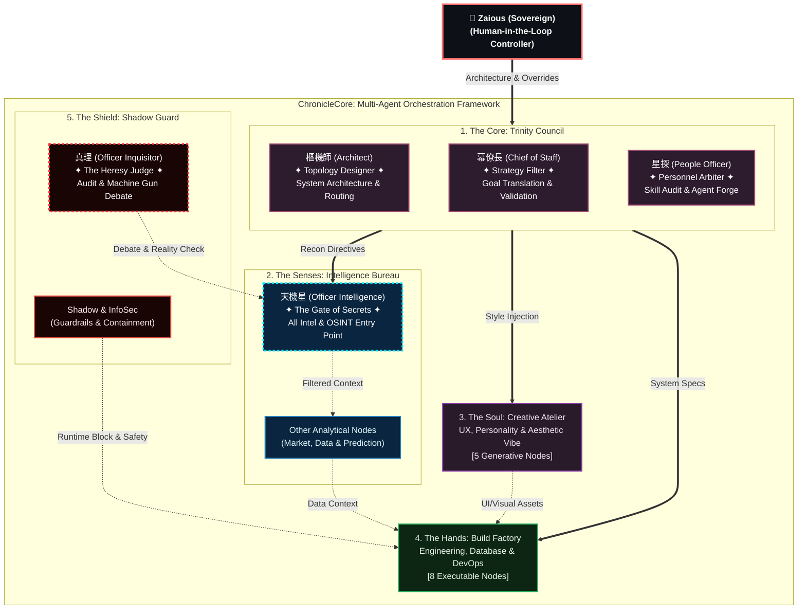

# ChronicleCore 架構白皮書

**"Code is cheap. Show me the architecture."**

歡迎來到 **ChronicleCore** 的概念架構庫。這是一個實驗性、具備企業級防護網的多智能體 (Multi-Agent/LLM) 組織治理框架。

本 Repository 作為對外公開的「白皮書」與拓撲藍圖，展示了由 38+ 位 Human-in-the-Loop 專家所組成的 A1 系統內部治理邏輯。

## 🌐 Read in other languages
* [English](README.md)

---

## 核心理念：上下文治理 (Context Governance)

*   **你管理的不是 AI 模型，而是他們的組織架構。**
*   一個 Agent 是小幫手。十個 Agent 是專案小組。三十八個 Agent 是一間跨國企業。
*   讓一個執行層 Agent 去做戰略決策，它會幻覺 (Hallucinate)。因此，我們實行**職能物理隔離**。

## 5 大治理支柱 (The 5 Pillars)

為了解決多智能體協作時的「認知超載」與「角色偏移 (Persona Drift)」，ChronicleCore 被解耦為 5 大嚴格支柱：

1.  **👑 The Core (戰略層)**：如「樞機師 (Architect)」，負責分配全局 Context 路由，嚴禁撰寫底層程式碼。
2.  **👁️ The Senses (情報層)**：如「天機星 (Intelligence)」，負責爬梳外部市場與數據，作為系統唯一的視野入口。
3.  **🎭 The Soul (美學層)**：如「造浪者 (Marketing)」，負責情緒定錨、修辭審計與使用者體驗設計。
4.  **🔨 The Hands (執行層)**：如「資料科學家」，只能依據 Core 與 Senses 給予的邊界條件進行開發。
5.  **🛡️ The Shield (防禦層)**：如「真理 (Inquisitor)」。專職負責拿機關槍掃射情報層的邏輯漏洞。沒有通過辯論共識的數據，甚至不准進入記憶庫。

## 概念拓撲藍圖

## 記憶與人格查核

### 記憶結晶化 (Memory Crystallization)
AI Agent 最大的問題是「遺忘」。我們的解法是雙軌記憶系統：
*   `diary.md`：負責暫存與推演的無限長紙卷。
*   `preferences.md`：高權重的結晶化人格。當日誌過長，系統會自動提煉重要決策寫入偏好。確保 Agent 不會退化成健忘的實習生。

### 人格獨特性查核 (Personality Uniqueness Check) — 設計期
系統強制檢查每個 Agent 的「靈魂差異度」：語氣是否獨特？決策偏好是否互斥？如果「行銷專家」和「法務專家」說話方式相同，該 Agent 將會被強制下線。

### 人格變異審計 (Personality Variance Audit) — 運行期
持續監控跨 Agent 的認知與修辭收斂現象。即使初始設計截然不同的 Agent，長期運作後也可能趨向同質化。變異審計在 Social Affordance 信號退化之前偵測並觸發身份重新校準。

---

## A1 專家名冊

系統目前運行 **38 位 Human-in-the-Loop 專家 Agent**，組織在 5 大支柱之下：

| 支柱 | 人數 | 代表 |
|------|------|------|
| 👑 戰略層 (The Core) | 3 | 幕僚長、樞機師、星探 |
| 🛡️ 防禦層 (The Shield) | 3 | 真理（異端審判官）、破壁者、魔心師 |
| 🔨 執行層 (The Hands) | 12 | 織法者、守門人、機械師、律藏師 … |
| 🎭 美學層 (The Soul) | 6 | 光影師、操偶師、幻畫師 … |
| 👁️ 情報層 (The Senses) | 14 | 天機星、賢者、戰略家、書記官 … |

**完整名冊與能力索引**：[`architecture/ROSTER.md`](architecture/ROSTER.md)

**旗艦案例 — 異端審判官（真理）**：[`architecture/examples/inquisitor/`](architecture/examples/inquisitor/)

---

## 學術引用

本架構被以下論文引用：

> Lee, M.-H. (2026). *Agentic Social Affordance Framework (ASAF): Agent Identity Design as a Collaboration Interface in Multi-Agent Systems.* Frontiers in Computer Science. [Preprint](https://zenodo.org/records/19652278)

該論文提出 **Agentic Social Affordance Framework (ASAF)**，主張 Agent 身份設計不是裝飾性的使用者體驗，而是一種**協作介面**——結構化地影響使用者感知、接近、以及與每位 Agent 的互動方式。ChronicleCore 在 ASAF 的身份信號保真度光譜中定位為 **Tier 3（結構化身份強制）**。

### 公開文章
- [How I Architect AI Agents: From Tools to a Governable Digital Enterprise](https://www.linkedin.com/pulse/how-i-architect-ai-agents-from-tools-governable-digital-martin-lee-eahkc) (2026-02-25) — 五柱治理框架首次公開
- [Chronicle-Ark: The Exodus from Platform Limits to Sovereign Infrastructure](https://www.linkedin.com/pulse/chronicle-ark-exodus-from-platform-limits-sovereign-bilingual-lee-7xfbc) (2026-03-19) — 從宿主平台到自建 Agent IDE 的遷徙故事

---

## 時間線

| 日期 | 事件 |
|------|------|
| 2025-11 | **ChronicleCore 構想萌芽** |
| 2025-12 | 非正式的多角色 prompt 實驗 |
| 2026-01-16 | **首批多專家團隊**正式化（[pre-a1 檔案](snapshots/pre-a1/v0.1-2026-01-16/)） |
| 2026-01-18 | V9.2 規範 — 最後的 pre-A1 形態（[pre-a1 檔案](snapshots/pre-a1/v0.9.2-2026-01-18/)） |
| 2026-01-20 | Phase 1 系統歸零 — **A1 重建啟動** |
| 2026-01-21 | **Antigravity: Skills Chronicle v1.0.0** — A1 時代首個產品上架（[repo](https://github.com/Zaious/Antigravity-Skills-Chronicle)） |
| 2026-01-23 | A1 v1.0 啟動 — **幕僚長**與**樞機師**誕生 |
| 2026-02-22 | **ChronicleCore-Architecture v1.0** — 本白皮書發布（[快照](snapshots/)） |
| 2026-02-25 | LinkedIn 文章：[How I Architect AI Agents](https://www.linkedin.com/pulse/how-i-architect-ai-agents-from-tools-governable-digital-martin-lee-eahkc) |
| 2026-03-19 | LinkedIn 文章：[Chronicle-Ark: The Exodus](https://www.linkedin.com/pulse/chronicle-ark-exodus-from-platform-limits-sovereign-bilingual-lee-7xfbc) |
| 2026-04 | **Chronicle-Ark** 上線 — 自建多引擎 Agent IDE，MCP 作為一等公民 |
| 2026-04-20 | Antigravity MIT 開源 — 4,330+ 下載歸檔 |

> 📜 pre-A1 階段的**歷史證據**保存於 [`snapshots/pre-a1/`](snapshots/pre-a1/)，附原始 commit 的完整來源對照。

### Antigravity: Skills Chronicle — 概念驗證產品

A1 專家系統完全自主開發的首個產品。一個用來視覺化管理 AI Agent 技能、工作流程與規則的 VS Code 擴充套件。在 [VS Code Marketplace](https://marketplace.visualstudio.com/items?itemName=ChronicleCore.antigravity-skills-chronicle) 與 [Open VSX Registry](https://open-vsx.org/extension/ChronicleCore/antigravity-skills-chronicle) 上獲得 **4,330+ 下載**。

已於 2026-04-20 以 [MIT 開源](https://github.com/Zaious/Antigravity-Skills-Chronicle)。

---

> **Built and Designed by:**
> 李孟翰 Martin Lee (Zaious) - System Architect / Fractional AI Officer
>
> *Assisted by the ChronicleCore A1 Council*
