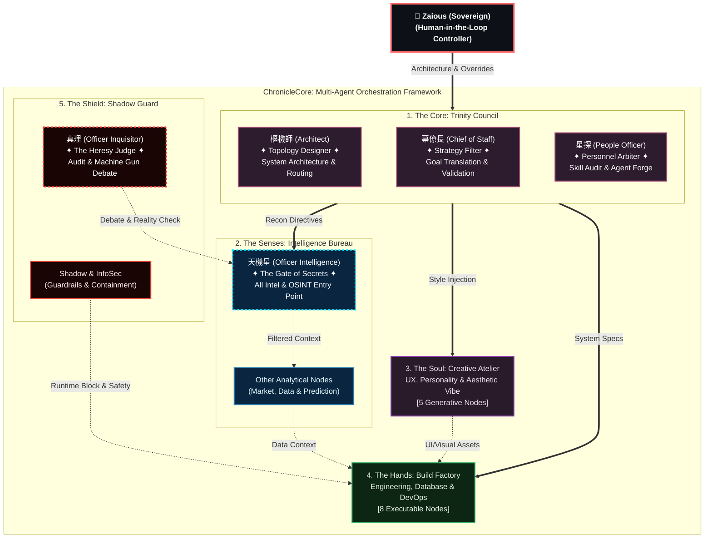

# ChronicleCore Conceptual Topology

This file contains the rendered conceptual map of the ChronicleCore Multi-Agent Architecture.

> **Date**: 2026-02-22
> **Purpose**: Conceptual visualization of 38+ entities abstracted into 5 core pillars.

