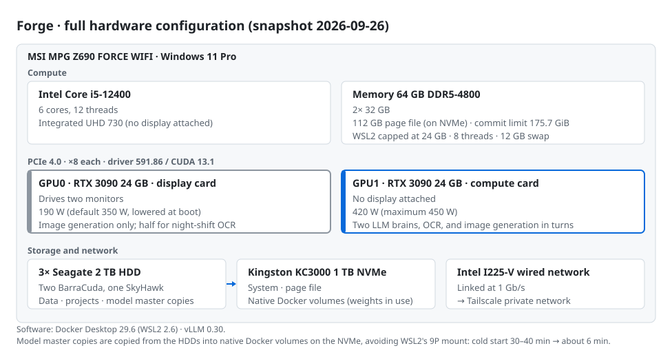

# ChronicleCore Empire Infrastructure — Hardware and Node Topology

English · [繁體中文](INFRASTRUCTURE_zh-TW.md)

> **Snapshot date**: 2026-09-26
> **Build period**: started 2026-07-04 → settled 2026-09-25 (12 weeks)
> **Purpose**: public description, and a dated record for future academic citation (following the practice of the [v1.0 whitepaper snapshot](../snapshots/v1.0-whitepaper.md))
> **Disclosure**: hardware, GPU configuration, and the relationships between machines are published in detail. The Empire's system and the Ark's software are described at the concept level only; their detailed specifications are kept in a private archive (see the hash at the end). IP addresses, domains, ports, credentials, and accounts are never listed. Nodes are referred to by codename.
> **Measurement**: every specification here was read directly from the machines on the snapshot date, not taken from purchase records or memory (methods at the end).

---

## From one computer to an empire

The [February 2026 whitepaper](../README.md) described how the experts are governed. This document describes where they live.

Chronicle-Ark, first generation, went live in April 2026 as an agent IDE on a single machine. From July 2026, ChronicleCore grew into a small empire of **4 always-on machines plus 3 mobile and build nodes**, joined by a Tailscale private network:

- a **Sanctum** that keeps the canon
- a **Forge** that supplies compute
- an **Outpost** that faces the public internet
- a **Watchdog** that lives apart from every machine it monitors

It is built entirely from consumer hardware and one retired laptop, with no rented GPU cloud.

---

## Build timeline (2026-07 → 2026-09)

| Date | Event | Evidence |
|---|---|---|
| 2026-07-04 | **Construction begins**: first commits to the law repository (law-repo) and the knowledge graph (chronicle-atlas) | First commit of each repository |
| 2026-07-04 / 05 | The 38 existing experts migrate together into the 2.0 six-layer identity structure; the same day **The Thinker (Kagami)** is born, the first expert created natively in the 2.0 structure rather than migrated | Signing dates on the registration cards; first commit of The Thinker's identity repository |
| 2026-07-06 | First commit of the second-generation Ark (ark2-app) | First commit |
| 2026-07-07 | The Sanctum is reinstalled and goes live; all 39 experts' identity modules are pushed to a self-hosted Gitea | Device registry |
| 2026-07-08 | The Outpost is hardened and its first public service goes live | Device registry |
| 2026-07-09 | Device registry and naming rules (display name, hostname, and tailnet name bound together) | Device registry |
| 2026-07-11 | The Sanctum API becomes a resident service; the first layer of restic encrypted backup goes live | First commit of sanctum-api |
| 2026-07-12 | PostgreSQL 17 + pgvector registry goes live; the Watchdog goes live; first commit of the embedding service | The Watchdog had been up continuously for 10 weeks 5 days on the snapshot date |
| 2026-07-13 | All seven tailnet nodes in place | Device registry |
| 2026-07-16 | First signed release of the law, `law-v1` | Signed Git tag |
| 2026-07-17 | Local vLLM runs on the Forge for the first time | Operations log |
| 2026-07-20 | Push notifications move to self-hosted Bark (the public push service is retired) | Service definition |
| 2026-07-21 | First commit of the OCR full-text pipeline | First commit of sanctum-ocr |
| 2026-07-22 | The embedding service moves to the CPU, freeing GPU memory | Decision record AD-46d |
| 2026-08-03 | The infrastructure scripts repository (infra) is created | First commit |
| 2026-09-06 | The Thinker (Kagami) is ensouled; the roster reaches 39 | Ensoulment date on the registration card; first diary entry |
| 2026-09-06 | Mechanical gates go live: when the same failure happens twice, it gets blocked by an exit code instead of another written rule | Decision record |
| 2026-09-16 / 19 / 24 | Signed releases `law-v2` / `law-v3` / `law-v4` | Signed Git tags |
| 2026-09-24 | Two brains: an automation brain and a conversation brain | Decision record D-VLLM-AUTO-01 |
| 2026-09-25 | **Settled**: on-demand GPU placement, automatic OCR runs, a GPU0 gaming guard | Decision record D-GPU0-GAME-01 |

### Twelve weeks of commits (as of 2026-09-26)

| Repository | Contents | First commit | Commits |
|---|---|---|---:|
| chronicle-lex | Papers and literature library (including night-shift commits) | 07-07 | 478 |
| ark2-app | Second-generation Ark (agent IDE) | 07-06 | 430 |
| claude-skills | Skill library | 07-12 | 186 |
| chronicle-atlas | Knowledge graph and retrieval | 07-04 | 160 |
| sovereign-biography | Biography and CV database | 07-16 | 128 |
| sanctum-api | Sanctum API | 07-11 | 116 |
| law-repo | Law (schemas and governance rules) | 07-04 | 103 |
| constitution | The Empire's constitution | 07-12 | 76 |
| infra | Infrastructure scripts | 08-03 | 60 |
| sanctum-ocr | OCR pipeline | 07-21 | 49 |
| sanctum-embed | Embedding service | 07-12 | 11 |
| **Total** | | | **1,797** |

(Not counting the 39 expert identity repositories.)

---

## Node overview

<picture>
  <source media="(prefers-color-scheme: dark)" srcset="diagrams/infrastructure-network.dark.svg">
  
</picture>

Source: [`diagrams/infrastructure-network.mmd`](diagrams/infrastructure-network.mmd)

| Codename | Role | Hardware (measured) | Operating system | Uptime |
|---|---|---|---|---|
| **Sanctum** (E3) | Canon authority, the one hard dependency | Intel Xeon E3-1231 v3 (4C/8T) · 16 GB DDR3 · 500 GB SATA SSD · GTX 1080 (not used for compute) | Ubuntu 24.04.4 LTS (kernel 6.8) | 24×7 |
| **Forge** | Workstation, local GPU compute, the Ark | Intel Core i5-12400 (6C/12T) · 64 GB DDR5-4800 · **2× RTX 3090 24 GB** · 1 TB NVMe + 3× 2 TB HDD | Windows 11 Pro + WSL2 / Docker | Always on |
| **Outpost** | The only public-facing node | Cloud KVM: 4 vCPU AMD EPYC · 8 GB · 72 GB | Ubuntu 24.04.4 LTS (kernel 6.8) | 24×7 |
| **Watchdog** | Monitoring, off-machine backup | Retired laptop: Intel Core i5-8265U (4C/8T) · 8 GB · 512 GB NVMe · battery as UPS | Ubuntu 24.04.4 LTS (kernel 6.17) | 24×7 |
| **Consul** | Notification terminal, mobile control window, iOS test device | iPhone | iOS | Carried |
| **Atelier** | Mobile writing station | Android tablet | Android | On demand |
| **Studio** | Apple build arm | MacBook Pro (Intel Core i5-1038NG7 · 16 GB) | macOS 26 · Xcode 26.5 | On demand |

The codename **E3** comes from the Sanctum's CPU family (Xeon E3).

### Machine state on the snapshot date (2026-09-26)

| Codename | Network | Memory | System disk | Load / temperature | Continuous uptime |
|---|---|---|---|---|---|
| Sanctum | Wired GbE (Killer E220x, 1000 Mb/s) | 1.1 of 15 GiB used; 4 GiB swap unused | 16 of 455 GB (4%) | Load 0.3; CPU 41 °C | 2 weeks 6 days (rebooted 09-06 after an incident) |
| Forge | Wired (Intel I225-V, 1 Gb/s) | 91.6 of 175.7 GiB commit used | 1 TB NVMe (see the chapter) | GPUs: see the chapter | Rebooted that day |
| Watchdog | Wi-Fi (Intel Wireless-AC) | 0.8 of 7.5 GiB used; 4 GiB swap unused | 9 of 98 GB (10%) | Load 0.00 | 10 weeks 5 days |
| Outpost | Cloud virtual NIC (virtio) | 2.2 of 7.8 GiB used; 2 GiB swap | 16 of 72 GB (23%) | Load 0.6–0.9 | 31 weeks 4 days |

---

## The nodes

### 🏛 Sanctum (E3) — canon authority

The one machine in the Empire that must not die. Every other node can be rebuilt; the Sanctum keeps what is true.

**Responsibilities**
- **Keeping the canon**: one Git repository per expert (identity module and diary), 39 in all, plus the law repository, all on a self-hosted Gitea.
- **Sanctum API** (Python / FastAPI): borrowing and returning experts; the borrowing records live in PostgreSQL.
- **Night shift**: experts' night work (diaries, watch shifts, literature upkeep) is driven by systemd timers.
- **Notification hub**: a self-hosted Bark server.
- **First backup layer**: restic end-to-end encrypted backup, daily, with regular restore drills.

**Guards**
- All 39 expert repositories carry push hooks (pre-receive): identity core files cannot be pushed without the Sovereign's authorization.
- An expert's memory can only be appended to, never rewritten.
- The law is released as signed tags (`law-vN`); only the Sovereign holds the signing key, and the Sanctum applies a release only after verifying the signature.

**Hardware**: a Xeon E3-1231 v3 (Haswell, 4C/8T) on an MSI B85-G43 motherboard, 16 GB DDR3, a 500 GB SATA SSD (LVM, 455 GB root), and wired Gigabit Ethernet (Killer E220x). There is a GTX 1080 in the case, with no driver installed: the Sanctum runs no models itself, and any work that needs one is sent to the Forge or to the cloud. On the snapshot date it was using 1.1 GiB of memory at a load of 0.3, with the CPU at 41 °C. Its workload is light; what it needs is stability.

**Software**: Ubuntu 24.04.4 · Gitea 1.22 (with an Actions runner) · PostgreSQL 17 + pgvector · FastAPI / uvicorn (Python 3.12) · Bark server · restic · Tailscale

### ⚒ Forge — workstation, compute, and the Ark

The Sovereign's main workstation, and the home of all of the Empire's GPU compute.

**Responsibilities**
- **The Ark** (Chronicle-Ark, second generation; Electron + React + TypeScript): a multi-engine agent IDE where experts work in rooms. Engines include Claude (Agent SDK), Codex, Gemini, and local vLLM.
- **Local compute**: two LLM brains, OCR, and image generation; see the dual-GPU chapter below.
- **Supporting services**: embedding (bge-m3, resident on the CPU) for semantic search. Two headless browser "arms" split the web work: Lightpanda (via MCP) handles light, frequent reading of public pages; Playwright (real Chromium) handles complex rendering and file downloads. The Sanctum's night shift also borrows Lightpanda over the tailnet.
- **Daily upkeep**: syncing the Sanctum's canon cache, producing the roster projection, and a health check of the paper library.

**The Ark is the only control panel for compute.** The Sovereign does not need to remember any script; every system operation is a button on the Ark's panel. Behind each button is a fixed command on a whitelist; the Ark cannot run arbitrary shell commands.

**Network**: an Intel I225-V wired adapter (a 2.5 GbE chip, currently linked at 1 Gb/s). Hardware details are in the chapter below.

**Software**: Windows 11 Pro · Docker Desktop 29.6 (WSL2 2.6) · vLLM 0.30 · Node / Electron · Python · Windows Task Scheduler

### 🛰 Outpost — the only public face

Every public service in the Empire lives here, and only here; it is also the only machine that accepts connections from the internet.

**Responsibilities**
- Caddy reverse proxy with automatic TLS. It currently fronts 6 public services: a waitlist, a biography MCP, a bibliographic search MCP, a catalog service, a journal-atlas API, and a trimmed self-hosted Supabase (Auth / Postgres / PostgREST / Studio).
- **Service factory**: a new public service takes three steps (scaffold → edit → deploy), with a dedicated system account, systemd autostart, and TLS set up automatically.

**Hardening**
- The firewall denies by default; public SSH is closed and login is only possible over the tailnet; fail2ban.
- Every public service's systemd unit is barred from the tailnet, and Docker containers are firewalled off from it too. **Even if a public service is compromised, it cannot reach the Sanctum.**

**Hardware**: a cloud KVM virtual machine with 4 vCPUs (AMD EPYC), 7.8 GiB of memory plus 2 GB of swap, and a 72 GB disk (23% used). It runs 6 containers, with Caddy, fail2ban, and ufw as resident services. This VPS predates the Empire: it had been up for 31 weeks 4 days on the snapshot date, and was hardened into the Outpost in July 2026.

### 🐕 Watchdog — monitoring and off-machine backup

Design principle: **the monitor must not live on a machine it monitors.** So the Watchdog is a separate retired laptop. Its screen broke, so it runs headless, and its battery serves as a ready-made UPS.

**Responsibilities**
- **Health checks** (about every 5 minutes):
  - Sanctum API health, plus a dead-man's switch that also catches silent failures where the service is alive but produced nothing all night.
  - An actual SSH login to the Sanctum, to confirm the machine itself can still be entered (see "Alive is not the same as healthy" below).
  - Forge online, Outpost online, and three public-facing sites.
  - It alerts only after two consecutive failures, reports recovery too, and stays quiet otherwise.
- **Heartbeat**: a check-in at 09:00 and 21:00 proves the Watchdog itself is still alive.
- **Second backup layer**: every day at 05:00 it mirrors the Sanctum's encrypted backup repository. Even if the whole Sanctum dies, the data is not lost.
- **Independent notification path**: the Watchdog runs its own Bark server (local-only), which does not go through the Sanctum. If the Sanctum goes down, the "Sanctum is down" alert still reaches the phone.

**Hardware**: a Core i5-8265U (Whiskey Lake, 4C/8T), 8 GB, and a 512 GB NVMe drive (98 GB root, 9 GB used). Both the integrated UHD 620 and the discrete MX250 sit unused. It has no wired network, only Wi-Fi. The battery has been through 95 charge cycles and holds 40.8 Wh when full, against a design capacity of 47.1 Wh (86.6% health).

It has run continuously since going live on 2026-07-12: 10 weeks 5 days of uptime on the snapshot date.

### 📱 Mobile and build nodes

These three nodes are not always on. They extend the Empire beyond the desk and connect it to Apple's platforms.

- **Consul** (iPhone): receives every Bark notification and serves as a mobile window into the Sanctum and the Ark over the tailnet. It is also the iOS test device: the phone itself sits on the tailnet, so an app under development can reach back into the Empire over the tailnet for testing, without sharing a local network with the development machine, even from outside the home.
- **Atelier** (Android tablet): a mobile writing station for working on papers away from the desk, connected back to the Empire over the tailnet.
- **Studio** (Intel MacBook Pro · macOS 26 · Xcode 26.5): the Empire's way into Apple's platforms. Native iOS apps (Swift) can only be built, signed, and submitted on a Mac; Expo apps are also built locally here (`eas build --local`) instead of using cloud build credits. The Forge drives the whole process over SSH on the tailnet, and the Mac is kept awake while it builds. Code is written on Windows, compiled on the Mac, and tested on the iPhone.

### 🔒 Non-public infrastructure: the Sovereign's dossier

A service that is not open to the public but is used every time something is written for the public.

- **The dossier**: a personal database kept as individual facts: positions, education, paper status, project dates, and so on. Each fact names its authority: paper status comes from the literature library; everything else comes from the dossier's ledger.
- **The public fact brief**: the dossier produces a public-view snapshot, served by an MCP service on the Outpost (OAuth 2.1; the endpoint is not published). Anyone in the Empire writing a website, a bio, a CV, or a cover letter reads this brief first.
- **Facts, not copy**: the brief supplies facts and the limits of what may be said publicly; the wording is up to whoever writes. Anything not in the brief is not for public use. New facts are not written in directly; they are proposed to a review queue for the Sovereign to approve.
- The service exposes 11 tools: reading the brief and the structured facts, reading and writing CV blocks, rendering CVs and cover letters, and proposing new facts.

The author's title and the paper status in this document were taken from that brief on 2026-09-26.

---

## Connections and interactions

### Network: one tailnet, two lines of isolation

- All nodes form a private mesh over Tailscale (WireGuard) and talk to each other only over the tailnet, never relying on the local network. The Sanctum and the Forge are not even on the same local subnet; the tailnet is the only path between them.
- The Sanctum's services (Gitea, the API, Bark) accept requests only on the tailnet; they have no public entry point at all.
- The Outpost is the only machine open to the internet, and its public services are barred from reaching back into the tailnet.

### Measured paths and latency

Measured on 2026-09-26 with `tailscale ping` between the nodes. All the paths ran direct peer-to-peer; none fell back to a Tailscale relay server (DERP).

| Path | Connection | Round-trip latency | What travels on it |
|---|---|---|---|
| Forge ↔ Sanctum | Direct (IPv6), wired at both ends | **2–3 ms** | Borrowing and returning experts, canon sync, night-shift work sent to the local model |
| Sanctum ↔ Watchdog | Direct; the Watchdog is on Wi-Fi | 7–119 ms (median about 23 ms) | Backup mirror, health checks |
| Forge ↔ Watchdog | Direct; the Watchdog is on Wi-Fi | 4–86 ms (medians of about 4 ms and 24 ms in two rounds) | Health checks |
| Forge ↔ Outpost | Direct, across continents | 282–314 ms (median about 303 ms) | Deployment, operations |
| Sanctum ↔ Outpost | Direct, across continents | 302–306 ms | No regular traffic between them |
| Watchdog ↔ Outpost | Direct, across continents | 301–331 ms (median about 329 ms) | Health checks |
| Forge ↔ Consul | Direct (mobile; relayed until the direct path forms) | 3–100 ms | Mobile viewing, iOS device testing |

The latencies line up with the roles. The traffic that goes back and forth most often (borrowing, returning, the night shift) runs over a wired direct link of 3 ms or less. The Outpost, on another continent, handles public services and has no high-frequency exchange with the rest of the Empire. The Watchdog's jitter comes from Wi-Fi and does not matter for a check every 5 minutes.

### Dependencies: what happens when a machine goes down

| Down | Effect | Who notices |
|---|---|---|
| **Sanctum** | Experts cannot be borrowed or returned; the night shift stops; the canon cannot change | Watchdog health checks (two consecutive failures) → the Watchdog's own Bark, bypassing the Sanctum |
| **Forge** | The Ark and local compute stop; the Sanctum's night shift continues, with work that needs the local model postponed or rerouted and work that needs the web paused | Watchdog health checks → Bark |
| **Watchdog** | Monitoring goes blind; the second backup layer pauses | The 09:00 and 21:00 heartbeats fail to arrive |
| **Outpost** | Public services go down; the Empire's internal work is unaffected | The Watchdog can only confirm the machine and its tailnet link are alive (see Known limitations) |

The Sanctum is the one hard dependency. If the Forge, the Watchdog, or the Outpost goes down, the other machines carry on; if the Sanctum goes down, the experts stop working. That is why its data has two backup layers and its alerts have a path that does not pass through it.

### Alive is not the same as healthy

On 2026-09-01 the Sanctum hit a kernel oops: tailscaled triggered a kernel error while enumerating network interfaces, and a lock in the networking stack ended up held forever by a dead thread. From then on, HTTP requests to Gitea and the Sanctum API kept returning 200 while other processes hung one after another and SSH connections were increasingly refused. The monitoring of the time only asked HTTP, so the degradation went unnoticed for four days, and in the end the machine had to be force-rebooted from its physical console.

Mechanisms left behind:

- An automatic reboot 30 seconds after a kernel oops.
- An hourly kernel-level self-check on the Sanctum: failed systemd units, and oops / lockup / hung-task entries in the kernel log.
- The Watchdog logs in to the Sanctum over SSH every 5 minutes; the Forge checks once a day from a second vantage point.

The same lesson showed up again on the Forge. On 2026-09-09, Lightpanda got stuck in an infinite loop in a tab left open and burned CPU for two days; its watchdog only checked for an HTTP response and reported healthy the whole time. The watchdog then gained a second criterion: if HTTP is alive but CPU stays above 80% for 30 minutes straight, the service is treated as spinning and restarted automatically.

Monitoring has to probe along the path that users actually take; a service's response code on its own is not enough.

### Data flows

<picture>
  <source media="(prefers-color-scheme: dark)" srcset="diagrams/infrastructure-dataflow.dark.svg">
  
</picture>

Source: [`diagrams/infrastructure-dataflow.mmd`](diagrams/infrastructure-dataflow.mmd)

| Direction | What | How |
|---|---|---|
| Ark (Forge) → Sanctum API | Borrowing and returning experts | Tailnet |
| Sanctum Gitea → Forge | Daily sync of the canon cache (expert identities, law) | Git |
| Sanctum night shift → Forge vLLM | Some routine night-shift work goes to the local model | OpenAI-compatible API over the tailnet |
| Sanctum night shift → Forge Lightpanda | When the night shift needs the web, it borrows the Forge's browser | Tailnet |
| Sanctum → Watchdog | Daily mirror of the restic encrypted backup repository | Tailnet |
| Watchdog → Sanctum, Forge, Outpost | Health checks, SSH login probe | Tailnet |
| Sanctum, Forge → Sanctum Bark → Consul | Night-shift reports, GPU events, alerts | Bark → Apple Push Notification service |
| Watchdog → Watchdog's own Bark → Consul | Health alerts, morning and evening heartbeat | Same; bypasses the Sanctum |
| Forge → Studio | Remote builds (iOS / Expo) | SSH over the tailnet |
| Consul → Forge | iOS device testing: an app under development reaches back into the Empire | Tailnet |
| Internet → Outpost | Public services | HTTPS (Caddy, automatic TLS) |
| Sovereign → Sanctum | Law releases | Signed tag → applied after verification |

### Three backup layers

| Layer | Where | Protects against | Status |
|---|---|---|---|
| First | restic encrypted repository on the Sanctum (daily; keeps 7 daily / 4 weekly / 6 monthly; 1.4 GB on the snapshot date) | Accidental deletion, corrupted files | ✅ Running |
| Second | Mirror on the Watchdog (daily at 05:00) | Loss of the whole Sanctum | ✅ Running |
| Third | Offline cold copy taken off-site | Site-level disaster | Planned |

Backups are end-to-end encrypted and kept on the Empire's own machines, not in a third-party cloud.

---

## System tools

| Tool | Purpose | Where |
|---|---|---|
| **Tailscale** | Private mesh, node identity, reachability across subnets | All nodes |
| **Bark** | iOS push notifications | Two self-hosted copies: one on the Sanctum (tailnet requests only) and one on the Watchdog (local-only, the independent path if the Sanctum goes down); both deliver through Apple Push Notification service |
| **Gitea** (+ Actions runner) | Canonical Git host, push hooks, CI | Sanctum |
| **PostgreSQL 17 + pgvector** | Lease registry, vectors | Sanctum |
| **restic** | End-to-end encrypted backup, two layers | Sanctum, Watchdog |
| **Caddy** | Reverse proxy + automatic TLS | Outpost |
| **Docker** | vLLM and browser containers; trimmed Supabase | Forge, Outpost |
| **systemd timers / Windows Task Scheduler** | Night shift, health checks, watchdogs | All always-on nodes |
| **Mechanical gates** | Development-side hooks: scan for secrets before a push, block dangerous commands. When the same failure happens twice, a gate gets built | Forge |

---

## Chapter: the Forge's dual-GPU compute

<picture>
  <source media="(prefers-color-scheme: dark)" srcset="diagrams/forge-hardware.dark.svg">
  
</picture>

Source data: [`diagrams/forge-hardware.draw.json`](diagrams/forge-hardware.draw.json)

### Hardware

| Item | Specification (measured) |
|---|---|
| CPU | Intel Core i5-12400 (6C/12T) |
| Motherboard | MSI MPG Z690 FORCE WIFI |
| Memory | 64 GB DDR5-4800 (2× 32 GB) |
| Page file | 112 GB, on the NVMe drive; commit limit 175.7 GiB, 91.6 GiB in use on the snapshot date |
| **GPU0** | NVIDIA RTX 3090 24 GB: the **display card** (drives two monitors). Default power limit 350 W, lowered to **190 W** at boot by a system-level scheduled task |
| **GPU1** | NVIDIA RTX 3090 24 GB: the **compute card**. Default power limit 420 W (maximum 450 W), kept at 420 W |
| Difference between the cards | Different vBIOS versions and different default power limits |
| PCIe | ×8 each, up to Gen 4; the link slows down automatically when idle (on the snapshot date GPU0 was at Gen 2 and GPU1 at Gen 1) |
| Driver | NVIDIA 591.86 · CUDA 13.1 |
| Integrated graphics | Intel UHD 730 (no display attached) |
| System drive | Kingston KC3000 1 TB NVMe: system, page file, native Docker volumes |
| Data drives | 3× Seagate 2 TB SATA HDD (two BarraCuda, one SkyHawk): data, projects, master copies of models |
| Network | Intel I225-V, wired, 1 Gb/s |
| Containers | Docker Desktop 29.6 · WSL2 2.6 · vLLM 0.30 |
| WSL2 limits | 24 GB memory, 8 processors, 12 GB swap; page cache released actively when idle |

Master copies of the models live on the data drive; the weights used at run time are copied into a native Docker volume (ext4). The reason: mounting Windows paths across the WSL2 boundary goes through the 9P protocol, which dragged a vLLM cold start out to 30–40 minutes. With a native volume it fell to about 6 minutes (measured 2026-07-22).

### Memory: the real wall is commit

When vLLM runs under WSL2 and Docker on Windows, the first limit it hits is the commit limit (physical memory plus the page file). There are two reasons:

- Whatever GPU memory a model uses inside WSL, the host records an equal amount against its commit.
- When vLLM cold-starts and reads its weights, the page cache pushes WSL's memory up to its limit, and it is not handed back on its own once loading finishes.

That is why, on the night of 2026-08-23, the system reported "out of virtual memory" six times while 23 GB of physical memory sat free. The current configuration:

- A 112 GB page file on the NVMe drive. Before 2026-08-10 the page file was on a hard disk, and heavy paging would freeze the whole machine for minutes.
- WSL2 capped at 24 GB, releasing its page cache actively when idle.
- Before any brain starts, the start gate estimates the commit peak of the cold start and refuses to start if it will not fit (since 2026-09-22).

### GPU memory snapshot (2026-09-26)

| Card | GPU memory | Power | Temperature | On it right now |
|---|---|---|---|---|
| GPU0 | 3,551 of 24,576 MiB | 52 W | 58 °C | The desktop only |
| GPU1 | 23,416 of 24,576 MiB | 12 W (standing by) | 34 °C | The automation brain (vLLM reserves its GPU memory at start) |

### Who lives on the GPUs

| Resident | Model | Where | Specifications and measurements |
|---|---|---|---|
| **Automation brain** | Qwen3.8-27B (AWQ W4A16) | GPU1 | 32K context · 44–46 tok/s · serves the Sanctum's night-shift clerical work |
| **Conversation brain** | Qwen3.8-27B uncensored community fine-tune (AWQ W4A16) | GPU1 | 56K context (fp8 KV cache) · 42–43 tok/s · tool calls about 1.5 s · started only when the Sovereign talks with the experts |
| **OCR** | baidu Unlimited-OCR (vLLM) | GPU1 (both cards when idle at night) | Full-text extraction of literature; 346 documents in the ledger |
| **Image generation** | ComfyUI · Krea 2 / Qwen-Image 2.1 | Depends on where the brain is (see below) | 13 model files, 68.8 GiB in total |
| **Embedding** | BAAI bge-m3 (1024 dimensions) | **CPU** | Moved off the GPU on 2026-07-22 to remove GPU-memory conflicts |
| **Browser arm (light)** | Lightpanda (MCP) | CPU (container) | Reading public pages; shared by the experts and the Sanctum's night shift |
| **Browser arm (heavy)** | Playwright (Chromium) | CPU (container) | Complex rendering, file downloads |

The two brains share one API endpoint, and only one of them runs at a time (see Known limitations for why). The Sanctum's night shift asks only for the automation brain's model name, so night-shift work never reaches the conversation brain.

Until 2026-09-25 the conversation brain was an MoE model spread across both cards. Once it became a single-card 27B model, GPU0 could be handed back in full to the desktop and image generation.

#### vLLM launch parameters

| Parameter | Automation brain | Conversation brain |
|---|---|---|
| Weights | Qwen3.8-27B, AWQ W4A16 asymmetric quantization | Uncensored fine-tune of the same base, same quantization |
| Context limit | 32,768 | 57,344 |
| GPU memory fraction | 0.92 | 0.92 |
| KV cache | Default precision | fp8 |
| Maximum concurrent sequences | 4 | 4 |
| Parallelism | Single card, bound to GPU1 | Single card, bound to GPU1 |
| Tool-call / reasoning parser | qwen3_xml / qwen3 | qwen3_xml / qwen3 |
| Language model only (no vision encoder) | Yes | Yes |
| Model names served | Two: its own name plus a name shared with the conversation brain | One: the shared name |

Binding to a card works only through `CUDA_VISIBLE_DEVICES`. The case of 2026-09-25: with only Docker's device option (`--gpus device=1`), the model still loaded onto GPU0.

The weights of each brain take 19.6 GB and sit in their own native Docker volume, with a further 2.2 GB volume for the compile cache. The vLLM image is 30.7 GB and the OCR image 27.7 GB.

#### Measured throughput

| Work | Measured | Conditions |
|---|---|---|
| Automation brain | 44–46 tok/s | Acceptance testing, 2026-09-24/25 |
| Conversation brain | 42–43 tok/s; tool calls about 1.5 s | Same |
| OCR | **1.62 s per page**, weighted by pages (median of batches 1.85, range 1.0–3.6) | The 28 batches with a closing record from 07-23 to 09-26: 292 documents, 25,007 pages; includes single-card and night-time dual-card batches |
| Image generation (GPU0, restricted mode) | About 390–520 s per image, with zero driver errors | Acceptance testing, 2026-09-25 |
| Image generation (GPU1) | Median about 17 s per image (6 images) | The run under way on the snapshot date; a different workflow from the GPU0 acceptance test, so the two cannot be compared directly |

### Coordination: take turns, don't cram

vLLM reserves its GPU memory the moment it starts and does not give it back when idle. So "wait until it is idle, then fit something else in" does not work. The Empire's rules for allocating compute:

- **Resident vs resident conflict → change the device.** Example: embedding moved from the GPU to the CPU.
- **Resident vs batch conflict → change the time.** Example: OCR, image generation, and the brains take turns on GPU1.

This is carried out by four mechanisms:

1. **Shift lock**: a cross-process file lock shared by OCR, ComfyUI, and the Ark. Whoever holds the lock uses the card; a lock not released after 8 hours is treated as stale.
2. **Start gate**: before any brain starts, the free GPU memory on each card and the system's commit headroom are measured. If there is not enough, it does not start, and whatever is occupying the space is named. A brain that never starts cannot burn.
3. **On-demand placement** (settled 2026-09-25): see the first table below.
4. **Watchdog schedules**: see the second table below.

#### Which card, when

| Situation | GPU0 (display card, 190 W) | GPU1 (compute card) |
|---|---|---|
| Normal | Desktop | Automation brain |
| The Sovereign is talking with experts | Desktop; ComfyUI runs here if images are needed | Conversation brain |
| Image generation only (no conversation) | Desktop | ComfyUI alone; the automation brain steps aside |
| New literature arrives (daytime) | Desktop | OCR; the brain steps aside and returns automatically afterwards |
| Night-shift OCR (idle ≥ 30 min) | OCR on half the card; released the moment anyone touches the keyboard or mouse | OCR |
| Gaming guard on | Game; any new work is blocked and a notification is sent | Unchanged |

GPU0 takes image generation only; video, LLMs, and daytime OCR never run on GPU0. Image generation on GPU0 runs under three limits: pinned memory off, 7 GB of GPU memory reserved for the desktop, and power ≤ 190 W. OCR reserves 85% of GPU memory on GPU1, and only 50% when the night shift uses GPU0.

<picture>
  <source media="(prefers-color-scheme: dark)" srcset="diagrams/gpu-vram.dark.svg">
  
</picture>

Source data: [`diagrams/gpu-vram.draw.json`](diagrams/gpu-vram.draw.json)

#### Example: pressing "start the conversation brain"

<picture>
  <source media="(prefers-color-scheme: dark)" srcset="diagrams/gpu-chat-brain.dark.svg">
  
</picture>

Source: [`diagrams/gpu-chat-brain.mmd`](diagrams/gpu-chat-brain.mmd)

The result: experts can talk and draw at the same time, and the Sovereign never has to switch anything by hand.

#### Watchdog schedules

| Watchdog | Frequency | What it does |
|---|---|---|
| vLLM watchdog | Every 10 min | Stops a brain stuck in a crash loop so it cannot spin and burn; switches back to the automation brain after 30 minutes without requests to the conversation brain |
| ComfyUI idle release | Every 10 min | Shuts ComfyUI down after its queue has been empty for 30 minutes, so the brain can return |
| Automatic OCR | Every 15 min | If new literature is waiting and the card is free, starts OCR on GPU1; the same list is run automatically at most once in 12 hours |
| Night-shift OCR | Daily at 02:00 | Judges idleness from the actual last input time rather than guessing a schedule; uses half of GPU0 only after ≥ 30 minutes idle |
| GPU0 power limit | At boot | Caps the display card at 190 W |
| Gaming guard | One button in the Ark | While on, no new work may start on GPU0; blocked work sends a notification |

The Ark's compute panel shows all of this on one screen: live usage of both cards, which brain is running, one-click brain switching, the gaming guard, and OCR batches with their shutdown button.

### Designed by incident

Each limit above corresponds to a real incident:

| Date | Incident | Mechanism left behind |
|---|---|---|
| 2026-07-21 | A dual-card OCR batch filled the display card's memory; the desktop lagged for hours | Batch work bound to GPU1 only |
| 2026-07-22 | Someone was still using the computer late at night; OCR filled GPU0 → the whole machine froze | Idleness judged from actual input; a GPU0 sentinel; GPU0 used at half capacity only |
| 2026-08-10 | A vLLM cold start pushed WSL's memory to its limit and paging hit the hard disk → the whole machine froze for minutes | WSL releases its cache when idle; the page file moved to NVMe |
| 2026-08-23 | "Out of virtual memory" six times in one night with 23 GB of physical memory free: the wall was the commit limit | Larger page file; WSL capped at 24 GB; GPU memory counted in the memory budget |
| 2026-09-09 / 09-15 | After a vLLM worker died, the other card spun in a busy wait, unnoticed for 26 hours | Crash-loop detection stops it immediately; a GPU-memory gate before start; watchdog alerts |
| 2026-09-15 | Under Windows the two cards were in SLI-linked mode, so the desktop's GPU memory allocation was mirrored in full onto the compute card, taking about 3.5 GB | The GPU-memory gate keeps a 1 GB margin and names the occupants when space runs short (measured again on 09-22, the two cards were independent) |
| 2026-09-22 | GPU memory looked sufficient, yet the vLLM cold start ran out of memory: the real wall was the host's commit | The start gate gained a commit-peak estimate |
| 2026-09-25 | With only Docker's device option set, the model still loaded onto GPU0 | Card binding set through `CUDA_VISIBLE_DEVICES` only |
| 2026-09-25 | Sustained video generation at full load on the display card → blue screen | GPU0 image generation only; 190 W; 7 GB reserved; gaming guard |

---

## Known limitations (2026-09-26)

- The Sanctum, the Forge, and the Watchdog share one location; only the cloud Outpost sits somewhere else.
- The Watchdog sits behind the home network and cannot reach the Outpost's public service layer, so for now it can only confirm that the Outpost machine and its tailnet connection are alive.
- The Sanctum has only 16 GB of memory, which will become a bottleneck as the vector store grows.
- The two brains cannot run at the same time, for two reasons. The first is GPU memory: GPU0 is kept for the desktop and image generation, so both brains can only live on GPU1. The second is host memory: the Forge has only 64 GB (2× 32 GB), and whatever GPU memory each brain uses inside WSL (about 23 GB) is charged again, in equal measure, against the host's commit. On 2026-09-22, for a vLLM load spanning both cards, the start gate estimated a commit peak of 140.1 GiB, 12.4 GiB over the limit of 127.7 GiB at the time. So while the Sovereign is in a conversation the automation brain is away, and night-shift work that needs the local model waits for it to come back.

---

## Measurement methods and sources

| Item | Method |
|---|---|
| Forge hardware | PowerShell `Get-CimInstance` (Win32_Processor / Win32_PhysicalMemory / Win32_BaseBoard / Win32_PageFileUsage), `Get-PhysicalDisk`, `Get-Volume`, `Get-NetAdapter` |
| GPUs | `nvidia-smi --query-gpu` (driver, vBIOS, power limits, GPU memory, temperature, PCIe link) |
| Linux nodes | Over SSH: `hostnamectl`, `lscpu`, `lspci`, `free -h`, `df -h`, `uptime -p`, `/proc/loadavg`, `sensors`, `systemctl`; the Watchdog's battery via `upower` and sysfs |
| Node list and paths | `tailscale status --json` (hostnames, operating systems, and connection type only); `tailscale ping` between the nodes |
| Timeline and commit counts | First entry of `git log --reverse` in each repository, `git rev-list --count HEAD`; creation dates of the law tags |
| Models and parameters | Launch arguments from `docker inspect` (keys excluded); throughput measured at acceptance on 2026-09-24/25 |
| OCR throughput | Document count, page count, and seconds per page from each OCR batch's closing record, weighted by pages |
| Events | The Empire's internal decision records (DECISIONS), device registry, and incident records |

---

The detailed specifications of the Empire's system and the Ark's software (lease procedures, night-shift routing, and so on) are kept in a private archive. SHA-256 of the detailed version of 2026-09-26: `9c7f0546a98f291a9816c32cf50ebe22f00528c13c82a822e3f9824765361aa4` (computed on UTF-8 with LF line endings).

---

> **Built and Designed by:**
> Meng-Han (Martin) Lee (Zaious) — System Architect of ChronicleCore · Independent Researcher & AI Consultant · [ORCID 0009-0007-1685-0877](https://orcid.org/0009-0007-1685-0877)
>
> *Assisted by the ChronicleCore expert council*
