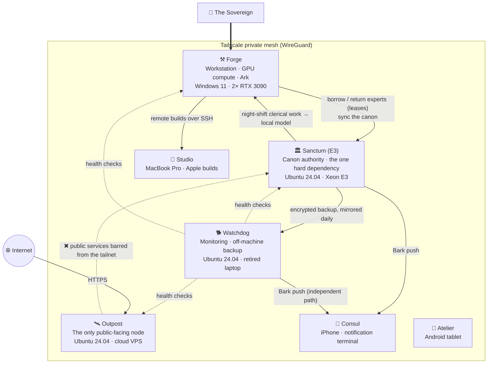

# ChronicleCore Empire Infrastructure — Hardware and Node Topology

English · [繁體中文](INFRASTRUCTURE_zh-TW.md)

> **Snapshot date**: 2026-09-26
> **Build period**: started 2026-07-04 → settled 2026-09-25 (12 weeks)
> **Purpose**: public description, and a dated record for future academic citation (following the practice of the [v1.0 whitepaper snapshot](../snapshots/v1.0-whitepaper.md))
> **Disclosure**: hardware, software, responsibilities, and connections are published; implementation details, IP addresses, domains, ports, credentials, and accounts are not. Nodes are referred to by codename. The full specification is kept in a private archive; see the hash at the end.
> **Measurement**: every specification here was read directly from the machines on the snapshot date, not taken from purchase records or memory (methods at the end).

---

## From one computer to an empire

The [February 2026 whitepaper](../README.md) described how the experts are governed. This document describes where they live.

Chronicle-Ark, first generation, went live in April 2026 as an agent IDE on a single machine. From July 2026, ChronicleCore grew into a small empire of **4 always-on machines plus 3 mobile and build nodes**, joined by a Tailscale private network:

- a **Sanctum** that keeps the canon
- a **Forge** that supplies compute
- an **Outpost** that faces the public internet
- a **Watchdog** that lives apart from every machine it monitors

It is built entirely from consumer hardware and one retired laptop, with no rented GPU cloud.

---

## Build timeline (2026-07 → 2026-09)

| Date | Event | Evidence |
|---|---|---|
| 2026-07-04 | **Construction begins**: first commits to the law repository (law-repo) and the knowledge graph (chronicle-atlas) | First commit of each repository |
| 2026-07-04 / 05 | The 38 existing experts migrate together into the 2.0 six-layer identity structure; the same day **The Thinker (Kagami)** is born, the first expert created natively in the 2.0 structure rather than migrated | Signing dates on the registration cards; first commit of The Thinker's identity repository |
| 2026-07-06 | First commit of the second-generation Ark (ark2-app) | First commit |
| 2026-07-07 | The Sanctum is reinstalled and goes live; all 39 experts' identity modules are pushed to a self-hosted Gitea | Device registry |
| 2026-07-08 | The Outpost is hardened and its first public service goes live | Device registry |
| 2026-07-09 | Device registry and naming rules (display name, hostname, and tailnet name bound together) | Device registry |
| 2026-07-11 | The Sanctum API becomes a resident service; the first layer of restic encrypted backup goes live | First commit of sanctum-api |
| 2026-07-12 | PostgreSQL 17 + pgvector registry goes live; the Watchdog goes live; first commit of the embedding service | The Watchdog had been up continuously for 10 weeks 5 days on the snapshot date |
| 2026-07-13 | All seven tailnet nodes in place | Device registry |
| 2026-07-16 | First signed release of the law, `law-v1` | Signed Git tag |
| 2026-07-17 | Local vLLM runs on the Forge for the first time | Operations log |
| 2026-07-20 | Push notifications move to self-hosted Bark (the public push service is retired) | Service definition |
| 2026-07-21 | First commit of the OCR full-text pipeline | First commit of sanctum-ocr |
| 2026-07-22 | The embedding service moves to the CPU, freeing GPU memory | Decision record AD-46d |
| 2026-08-03 | The infrastructure scripts repository (infra) is created | First commit |
| 2026-09-06 | The Thinker (Kagami) is ensouled; the roster reaches 39 | Ensoulment date on the registration card; first diary entry |
| 2026-09-06 | Mechanical gates go live: when the same failure happens twice, it gets blocked by an exit code instead of another written rule | Decision record |
| 2026-09-16 / 19 / 24 | Signed releases `law-v2` / `law-v3` / `law-v4` | Signed Git tags |
| 2026-09-24 | Two brains: an automation brain and a conversation brain | Decision record D-VLLM-AUTO-01 |
| 2026-09-25 | **Settled**: on-demand GPU placement, automatic OCR runs, a GPU0 gaming guard | Decision record D-GPU0-GAME-01 |

### Twelve weeks of commits (as of 2026-09-26)

| Repository | Contents | First commit | Commits |
|---|---|---|---:|
| chronicle-lex | Papers and literature library (including night-shift commits) | 07-07 | 478 |
| ark2-app | Second-generation Ark (agent IDE) | 07-06 | 430 |
| claude-skills | Skill library | 07-12 | 186 |
| chronicle-atlas | Knowledge graph and retrieval | 07-04 | 160 |
| sovereign-biography | Biography and CV database | 07-16 | 128 |
| sanctum-api | Sanctum API | 07-11 | 116 |
| law-repo | Law (schemas and governance rules) | 07-04 | 103 |
| constitution | The Empire's constitution | 07-12 | 76 |
| infra | Infrastructure scripts | 08-03 | 60 |
| sanctum-ocr | OCR pipeline | 07-21 | 49 |
| sanctum-embed | Embedding service | 07-12 | 11 |
| **Total** | | | **1,797** |

(Not counting the 39 expert identity repositories.)

---

## Node overview

| Codename | Role | Hardware (measured) | Operating system | Uptime |
|---|---|---|---|---|
| **Sanctum** (E3) | Canon authority, the one hard dependency | Intel Xeon E3-1231 v3 (4C/8T) · 16 GB DDR3 · 500 GB SATA SSD · GTX 1080 (not used for compute) | Ubuntu 24.04.4 LTS (kernel 6.8) | 24×7 |
| **Forge** | Workstation, local GPU compute, the Ark | Intel Core i5-12400 (6C/12T) · 64 GB DDR5-4800 · **2× RTX 3090 24 GB** · 1 TB NVMe + 3× 2 TB HDD | Windows 11 Pro + WSL2 / Docker | Always on |
| **Outpost** | The only public-facing node | Cloud KVM: 4 vCPU AMD EPYC · 8 GB · 72 GB | Ubuntu 24.04.4 LTS (kernel 6.8) | 24×7 |
| **Watchdog** | Monitoring, off-machine backup | Retired laptop: Intel Core i5-8265U (4C/8T) · 8 GB · 512 GB NVMe · battery as UPS | Ubuntu 24.04.4 LTS (kernel 6.17) | 24×7 |
| **Consul** | Notification terminal, mobile control window | iPhone | iOS | Carried |
| **Atelier** | Mobile writing station | Android tablet | Android | On demand |
| **Studio** | Apple build arm | MacBook Pro (Intel Core i5-1038NG7 · 16 GB) | macOS 26 · Xcode 26.5 | On demand |

The codename **E3** comes from the Sanctum's CPU family (Xeon E3).

---

## The nodes

### 🏛 Sanctum (E3) — canon authority

The one machine in the Empire that must not die. Every other node can be rebuilt; the Sanctum keeps what is true.

**Responsibilities**
- **Keeping the canon**: one Git repository per expert (identity module and diary), 39 in all, plus the law repository, all on a self-hosted Gitea.
- **Sanctum API** (Python / FastAPI): borrowing and returning experts; the borrowing records live in PostgreSQL.
- **Night shift**: experts' night work (diaries, watch shifts, literature upkeep) is driven by systemd timers.
- **Notification hub**: a self-hosted Bark server.
- **First backup layer**: restic end-to-end encrypted backup, daily, with regular restore drills.

**Guards**
- All 39 expert repositories carry push hooks (pre-receive): identity core files cannot be pushed without the Sovereign's authorization.
- An expert's memory can only be appended to, never rewritten.
- The law is released as signed tags (`law-vN`); only the Sovereign holds the signing key, and the Sanctum applies a release only after verifying the signature.

**Software**: Ubuntu 24.04.4 · Gitea 1.22 (with an Actions runner) · PostgreSQL 17 + pgvector · FastAPI / uvicorn (Python 3.12) · Bark server · restic · Tailscale

### ⚒ Forge — workstation, compute, and the Ark

The Sovereign's main workstation, and the home of all of the Empire's GPU compute.

**Responsibilities**
- **The Ark** (Chronicle-Ark, second generation; Electron + React + TypeScript): a multi-engine agent IDE where experts work in rooms. Engines include Claude (Agent SDK), Codex, Gemini, and local vLLM.
- **Local compute**: two LLM brains, OCR, and image generation; see the dual-GPU chapter below.
- **Supporting services**: embedding (bge-m3, resident on the CPU) for semantic search; a headless browser (Lightpanda, MCP) so experts can use the web.
- **Daily upkeep**: syncing the Sanctum's canon cache, producing the roster projection, and a health check of the paper library.

**The Ark is the only control panel for compute.** The Sovereign does not need to remember any script; every system operation is a button on the Ark's panel. Behind each button is a fixed command on a whitelist; the Ark cannot run arbitrary shell commands.

**Software**: Windows 11 Pro · Docker Desktop 29.6 (WSL2 2.6) · vLLM 0.30 · Node / Electron · Python · Windows Task Scheduler

### 🛰 Outpost — the only public face

Every public service in the Empire lives here, and only here; it is also the only machine that accepts connections from the internet.

**Responsibilities**
- Caddy reverse proxy with automatic TLS. It currently fronts 6 public services: a waitlist, a biography MCP, a bibliographic search MCP, a catalog service, a journal-atlas API, and a trimmed self-hosted Supabase (Auth / Postgres / PostgREST / Studio).
- **Service factory**: a new public service takes three steps (scaffold → edit → deploy), with a dedicated system account, systemd autostart, and TLS set up automatically.

**Hardening**
- The firewall denies by default; public SSH is closed and login is only possible over the tailnet; fail2ban.
- Every public service's systemd unit is barred from the tailnet, and Docker containers are firewalled off from it too. **Even if a public service is compromised, it cannot reach the Sanctum.**

### 🐕 Watchdog — monitoring and off-machine backup

Design principle: **the monitor must not live on a machine it monitors.** So the Watchdog is a separate retired laptop. Its screen broke, so it runs headless, and its battery serves as a ready-made UPS.

**Responsibilities**
- **Health checks** (about every 5 minutes):
  - Sanctum API health, plus a dead-man's switch that also catches silent failures where the service is alive but produced nothing all night.
  - Forge online, Outpost online, and three public-facing sites.
  - It alerts only after two consecutive failures, reports recovery too, and stays quiet otherwise.
- **Heartbeat**: a check-in at 09:00 and 21:00 proves the Watchdog itself is still alive.
- **Second backup layer**: every day at 05:00 it mirrors the Sanctum's encrypted backup repository. Even if the whole Sanctum dies, the data is not lost.
- **Independent notification path**: the Watchdog runs its own Bark server (local-only), which does not go through the Sanctum. If the Sanctum goes down, the "Sanctum is down" alert still reaches the phone.

It has run continuously since going live on 2026-07-12: 10 weeks 5 days of uptime on the snapshot date.

### 📱 Mobile and build nodes

- **Consul** (iPhone): receives every Bark notification and serves as a mobile window into the Sanctum and the Ark over the tailnet.
- **Atelier** (Android tablet): a mobile writing station.
- **Studio** (Intel MacBook Pro · macOS 26 · Xcode 26.5): the Forge drives Swift / iOS builds and local Expo builds on it over SSH. Code is written on Windows and compiled on the Mac.

### 🔒 Non-public infrastructure: the Sovereign's dossier

A service that is not open to the public but is used every time something is written for the public.

- **The dossier**: a personal database kept as individual facts: positions, education, paper status, project dates, and so on. Each fact names its authority: paper status comes from the literature library; everything else comes from the dossier's ledger.
- **The public fact brief**: the dossier produces a public-view snapshot, served by an MCP service on the Outpost (OAuth 2.1; the endpoint is not published). Anyone in the Empire writing a website, a bio, a CV, or a cover letter reads this brief first.
- **Facts, not copy**: the brief supplies facts and the limits of what may be said publicly; the wording is up to whoever writes. Anything not in the brief is not for public use. New facts are not written in directly; they are proposed to a review queue for the Sovereign to approve.
- The service exposes 11 tools: reading the brief and the structured facts, reading and writing CV blocks, rendering CVs and cover letters, and proposing new facts.

The author's title and the paper status in this document were taken from that brief on 2026-09-26.

---

## Connections and interactions

### Network: one tailnet, two lines of isolation

- All nodes form a private mesh over Tailscale (WireGuard) and talk to each other only over the tailnet, never relying on the local network. The Sanctum and the Forge are not even on the same local subnet; the tailnet is the only path between them.
- The Sanctum's services (Gitea, the API, Bark) accept requests only on the tailnet; they have no public entry point at all.
- The Outpost is the only machine open to the internet, and its public services are barred from reaching back into the tailnet.

### Data flows

| Direction | What | How |
|---|---|---|
| Ark (Forge) → Sanctum API | Borrowing and returning experts | Tailnet |
| Sanctum Gitea → Forge | Daily sync of the canon cache (expert identities, law) | Git |
| Sanctum night shift → Forge vLLM | Some routine night-shift work goes to the local model | Tailnet |
| Sanctum → Watchdog | Daily mirror of the restic encrypted backup repository | Tailnet |
| Watchdog → Sanctum, Forge, Outpost | Health checks | Tailnet |
| Sanctum, Forge → Sanctum Bark → Consul | Night-shift reports, GPU events, alerts | Bark → Apple Push Notification service |
| Watchdog → Watchdog's own Bark → Consul | Health alerts, morning and evening heartbeat | Same; bypasses the Sanctum |
| Forge → Studio | Remote builds | SSH over the tailnet |
| Internet → Outpost | Public services | HTTPS (Caddy, automatic TLS) |
| Sovereign → Sanctum | Law releases | Signed tag → applied after verification |

### Three backup layers

| Layer | Where | Protects against | Status |
|---|---|---|---|
| First | restic encrypted repository on the Sanctum (daily; keeps 7 daily / 4 weekly / 6 monthly) | Accidental deletion, corrupted files | ✅ Running |
| Second | Mirror on the Watchdog (daily at 05:00) | Loss of the whole Sanctum | ✅ Running |
| Third | Offline cold copy taken off-site | Site-level disaster | Planned |

Backups are end-to-end encrypted and kept on the Empire's own machines, not in a third-party cloud.

---

## System tools

| Tool | Purpose | Where |
|---|---|---|
| **Tailscale** | Private mesh, node identity, reachability across subnets | All nodes |
| **Bark** | iOS push notifications | Two self-hosted copies: one on the Sanctum (tailnet requests only) and one on the Watchdog (local-only, the independent path if the Sanctum goes down); both deliver through Apple Push Notification service |
| **Gitea** (+ Actions runner) | Canonical Git host, push hooks, CI | Sanctum |
| **PostgreSQL 17 + pgvector** | Lease registry, vectors | Sanctum |
| **restic** | End-to-end encrypted backup, two layers | Sanctum, Watchdog |
| **Caddy** | Reverse proxy + automatic TLS | Outpost |
| **Docker** | vLLM and browser containers; trimmed Supabase | Forge, Outpost |
| **systemd timers / Windows Task Scheduler** | Night shift, health checks, watchdogs | All always-on nodes |
| **Mechanical gates** | Development-side hooks: scan for secrets before a push, block dangerous commands. When the same failure happens twice, a gate gets built | Forge |

---

## Chapter: the Forge's dual-GPU compute

### Hardware

| Item | Specification (measured) |
|---|---|
| CPU | Intel Core i5-12400 (6C/12T) |
| Memory | 64 GB DDR5-4800 (2× 32 GB); 112 GB page file (commit limit about 176 GiB) |
| Motherboard | MSI MPG Z690 FORCE WIFI |
| **GPU0** | NVIDIA RTX 3090 24 GB: the **display card** (drives two monitors). Power limit lowered from the default 350 W to **190 W**, applied at boot by a system-level scheduled task |
| **GPU1** | NVIDIA RTX 3090 24 GB: the **compute card**, power limit 420 W |
| PCIe | Each card runs at PCIe 4.0 ×8 |
| Integrated graphics | Intel UHD 730 (no display attached) |
| Storage | Kingston KC3000 1 TB NVMe (system, native Docker volumes) · 3× Seagate 2 TB HDD (data, master copies of models) |
| Containers | Docker Desktop 29.6 · WSL2 2.6 · vLLM 0.30 |

Master copies of the models live on the data drive; the weights used at run time are copied into a native Docker volume (ext4). The reason: mounting Windows paths across the WSL2 boundary goes through the 9P protocol, which dragged a vLLM cold start out to 30–40 minutes. With a native volume it fell to about 6 minutes (measured 2026-07-22).

### Who lives on the GPUs

| Resident | Model | Where | Specifications and measurements |
|---|---|---|---|
| **Automation brain** | Qwen3.8-27B (AWQ W4A16) | GPU1 | 32K context · 44–46 tok/s · serves the Sanctum's night-shift clerical work |
| **Conversation brain** | Qwen3.8-27B uncensored community fine-tune (AWQ W4A16) | GPU1 | 56K context (fp8 KV cache) · 42–43 tok/s · tool calls about 1.5 s · started only when the Sovereign talks with the experts |
| **OCR** | baidu Unlimited-OCR (vLLM) | GPU1 (both cards when idle at night) | Full-text extraction of literature; 346 documents in the ledger |
| **Image generation** | ComfyUI · Krea 2 / Qwen-Image 2.1 | Depends on where the brain is (see below) | 13 model files, 68.8 GiB in total |
| **Embedding** | BAAI bge-m3 (1024 dimensions) | **CPU** | Moved off the GPU on 2026-07-22 to remove GPU-memory conflicts |
| **Headless browser** | Lightpanda (MCP) | CPU (container) | For experts to use the web |

Only one of the two brains runs at a time, and night-shift work only ever goes to the automation brain.

### Coordination: take turns, don't cram

vLLM reserves its GPU memory the moment it starts and does not give it back when idle, so "wait until it is idle, then fit something else in" does not work. The Empire follows two rules:

- **Resident vs resident conflict → change the device.** Example: embedding moved from the GPU to the CPU.
- **Resident vs batch conflict → change the time.** Example: OCR, image generation, and the brains take turns on the compute card.

In practice, schedulers and watchdogs coordinate this automatically. Normally the automation brain is on duty on the compute card. When the Sovereign talks with the experts, it is replaced by the conversation brain; if an image is needed then, image generation moves to the display card on its own, so an expert can talk and draw at the same time. When new literature arrives, OCR takes its turn automatically. For gaming, one button locks the display card. Every switch is either automatic or a single button on the Ark's compute panel. The display card takes image generation only, with its power limited and GPU memory reserved for the desktop.

### Designed by incident

Each limit above corresponds to a real incident:

| Date | Incident | Mechanism left behind |
|---|---|---|
| 2026-07-21 | A dual-card OCR batch filled the display card's memory; the desktop lagged for hours | Batch work kept off the display card |
| 2026-07-22 | Someone was still using the computer late at night; OCR filled GPU0 → the whole machine froze | Idleness judged from actual use; limited use of the display card |
| 2026-09-09 / 09-15 | After a vLLM worker died, the other card spun in a busy wait, unnoticed for 26 hours | Automatic stop on crashes; resource checks before start; watchdog alerts |
| 2026-09-25 | Sustained generation at full load on the display card → blue screen | Display card limited to image generation at reduced power; one-button lock for gaming |

---

## Known limitations (2026-09-26)

- The Sanctum, the Forge, and the Watchdog share one location; only the cloud Outpost sits somewhere else. The third, offline cold-backup layer is not yet automated.
- The Watchdog sits behind the home network and cannot reach the Outpost's public service layer, so for now it can only confirm that the Outpost machine and its tailnet connection are alive.
- The Sanctum has only 16 GB of memory, which will become a bottleneck as the vector store grows.

---

## Measurement methods and sources

| Item | Method |
|---|---|
| Forge hardware | PowerShell `Get-CimInstance` (Win32_Processor / Win32_PhysicalMemory / Win32_BaseBoard), `Get-PhysicalDisk`, `nvidia-smi --query-gpu` |
| Linux nodes | Over SSH: `hostnamectl`, `lscpu`, `free -h`, `lsblk` / `df -h`, `uptime -p`, `systemctl` |
| Node list | `tailscale status --json` (hostnames and operating systems only) |
| Timeline and commit counts | First entry of `git log --reverse` in each repository, `git rev-list --count HEAD`; creation dates of the law tags |
| Models and parameters | Launch arguments from `docker inspect`; throughput measured at acceptance on 2026-09-24/25 |
| Events | The Empire's internal decision records (DECISIONS) and device registry |

---

The full specification (detailed version of 2026-09-26) is kept in a private archive. SHA-256: `9c7f0546a98f291a9816c32cf50ebe22f00528c13c82a822e3f9824765361aa4` (computed on UTF-8 with LF line endings).

---

> **Built and Designed by:**
> Meng-Han (Martin) Lee (Zaious) — System Architect of ChronicleCore · Independent Researcher & AI Consultant · [ORCID 0009-0007-1685-0877](https://orcid.org/0009-0007-1685-0877)
>
> *Assisted by the ChronicleCore expert council*
