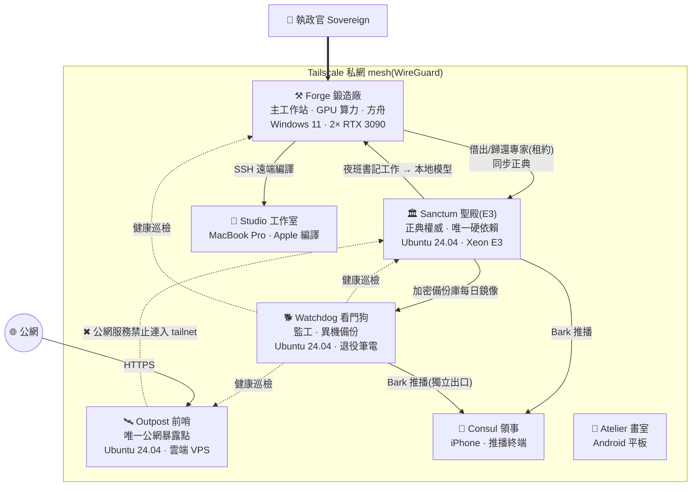

# ChronicleCore 帝國基礎設施 — 硬體配置與節點拓撲

[English](INFRASTRUCTURE.md) · 繁體中文

> **快照日期**:2026-09-26
> **施工期間**:2026-07-04 開工 → 2026-09-25 定型(12 週)
> **用途**:對外說明,並作為日後學術引用的時間點佐證(比照 [v1.0 白皮書快照](../snapshots/v1.0-whitepaper.md) 的做法)
> **揭露原則**:硬體規格、軟體、職責與串聯方式公開;實作細節、IP 位址、網域、埠號、憑證、帳號不列。節點以代號稱呼。完整規格存於私有庫,見文末的雜湊。
> **量測原則**:本文的規格都是快照日直接從機器上查到的,不是採購單,也不是憑記憶寫的(方法見文末〈量測方法與來源〉)。

---

## 從一台電腦到一個帝國

[2026-02 的白皮書](../README_zh-TW.md)說明的是「專家怎麼被治理」;這份文件說明的是「那些專家住在哪裡」。

2026-04 上線的 Chronicle-Ark 一代,是跑在單機上的 Agent IDE。2026-07 起,ChronicleCore 擴建成一個由 **4 台常駐機器 + 3 個行動/編譯節點** 組成、以 Tailscale 私網串聯的小型帝國:

- 一座保存正典的**聖殿**
- 一座提供算力的**鍛造廠**
- 一座面對公網的**前哨**
- 一隻獨立於所有被監控機器之外的**看門狗**

全部由消費級硬體與一台退役筆電組成,沒有租用任何 GPU 雲。

---

## 施工時間軸(2026-07 → 2026-09)

| 日期 | 事件 | 佐證 |
|---|---|---|
| 2026-07-04 | **開工**:律法倉(law-repo)與知識圖譜(chronicle-atlas)首次提交 | 兩倉第一筆 commit |
| 2026-07-04 / 05 | 38 位既有專家齊頭遷入 2.0 六層身分結構;同日**思者(鏡)**誕生,是第一位直接以 2.0 結構生成、不經遷移的專家 | 各專家登記卡簽日;思者身分倉第一筆 commit |
| 2026-07-06 | 方舟二代(ark2-app)首次提交 | 第一筆 commit |
| 2026-07-07 | 聖殿重灌上線;39 位專家的身分模組全數推入自架 Gitea | 裝置造冊 |
| 2026-07-08 | 前哨完成加固,第一個對外服務上線 | 裝置造冊 |
| 2026-07-09 | 裝置造冊,定下命名總則(顯示名/主機名/tailnet 名三名綁死) | 裝置造冊 |
| 2026-07-11 | 聖殿 API 成為常駐服務;restic 加密備份第一層上線 | sanctum-api 第一筆 commit |
| 2026-07-12 | PostgreSQL 17 + pgvector 登記簿上線;看門狗上線;embedding 服務首次提交 | 看門狗至快照日連續開機 10 週 5 天 |
| 2026-07-13 | tailnet 七節點齊全 | 裝置造冊 |
| 2026-07-16 | 律法第一版簽章標記 `law-v1` | Git 簽章 tag |
| 2026-07-17 | 本地 vLLM 首次在鍛造廠上線 | 營運紀錄 |
| 2026-07-20 | 推播改為自架 Bark(退役公共推播服務) | 服務定義 |
| 2026-07-21 | OCR 全文補抽管線首次提交 | sanctum-ocr 第一筆 commit |
| 2026-07-22 | embedding 遷到 CPU 常駐,讓出顯存 | 決策紀錄 AD-46d |
| 2026-08-03 | 基礎設施腳本倉(infra)成立 | 第一筆 commit |
| 2026-09-06 | 思者(鏡)注魂,專家增至 39 位 | 登記卡注魂日;日記首篇 |
| 2026-09-06 | 機械閘上線:同一種失敗第二次出現,就用 exit code 擋,不再寫口頭紀律 | 決策紀錄 |
| 2026-09-16 / 19 / 24 | 律法 `law-v2` / `law-v3` / `law-v4` 簽章 | Git 簽章 tag |
| 2026-09-24 | 雙腦制:自動化腦與對話腦分立 | 決策紀錄 D-VLLM-AUTO-01 |
| 2026-09-25 | **定型**:GPU 依需求自動配置、OCR 自動開跑、GPU0 遊戲護欄 | 決策紀錄 D-GPU0-GAME-01 |

### 12 週的提交量(統計至 2026-09-26)

| 倉庫 | 內容 | 首次提交 | 提交數 |
|---|---|---|---:|
| chronicle-lex | 論文與文獻庫(含夜班自動提交) | 07-07 | 478 |
| ark2-app | 方舟二代(Agent IDE) | 07-06 | 430 |
| claude-skills | 技能庫 | 07-12 | 186 |
| chronicle-atlas | 知識圖譜與檢索 | 07-04 | 160 |
| sovereign-biography | 履歷資料庫 | 07-16 | 128 |
| sanctum-api | 聖殿 API | 07-11 | 116 |
| law-repo | 律法(schema 與治理規則) | 07-04 | 103 |
| constitution | 帝國憲法 | 07-12 | 76 |
| infra | 基礎設施腳本 | 08-03 | 60 |
| sanctum-ocr | OCR 管線 | 07-21 | 49 |
| sanctum-embed | embedding 服務 | 07-12 | 11 |
| **合計** | | | **1,797** |

(不含 39 個專家身分倉。)

---

## 節點總覽

| 代號 | 角色 | 硬體(實測) | 作業系統 | 運轉 |
|---|---|---|---|---|
| **Sanctum 聖殿**(E3) | 正典權威、唯一硬依賴 | Intel Xeon E3-1231 v3(4C/8T)· 16 GB DDR3 · 500 GB SATA SSD · GTX 1080(未啟用運算) | Ubuntu 24.04.4 LTS(kernel 6.8) | 24×7 |
| **Forge 鍛造廠** | 主工作站、本地 GPU 算力、方舟 | Intel Core i5-12400(6C/12T)· 64 GB DDR5-4800 · **2× RTX 3090 24 GB** · 1 TB NVMe + 3× 2 TB HDD | Windows 11 Pro + WSL2 / Docker | 常開 |
| **Outpost 前哨** | 唯一公網暴露點 | 雲端 KVM:4 vCPU AMD EPYC · 8 GB · 72 GB | Ubuntu 24.04.4 LTS(kernel 6.8) | 24×7 |
| **Watchdog 看門狗** | 監工、異機備份 | 退役筆電:Intel Core i5-8265U(4C/8T)· 8 GB · 512 GB NVMe · 電池兼 UPS | Ubuntu 24.04.4 LTS(kernel 6.17) | 24×7 |
| **Consul 領事** | 推播終端、行動控制窗 | iPhone | iOS | 隨身 |
| **Atelier 畫室** | 行動寫作工作台 | Android 平板 | Android | 按需 |
| **Studio 工作室** | Apple 編譯手臂 | MacBook Pro(Intel Core i5-1038NG7 · 16 GB) | macOS 26 · Xcode 26.5 | 按需 |

代號 **E3** 取自聖殿的 CPU 系列(Xeon E3)。

---

## 各節點詳述

### 🏛 Sanctum 聖殿(E3)— 正典權威

整個帝國唯一不能死的機器。其他節點倒下都能重建,聖殿保存的是「什麼是真的」。

**職責**
- **正典保存**:39 位專家各自一個 Git 倉(身分模組+日記)、律法倉,全部住在自架 Gitea。
- **聖殿 API**(Python / FastAPI):專家的借出與歸還;借出紀錄存在 PostgreSQL。
- **夜班**:專家的夜間工作(日誌、守望班、文獻整理)由 systemd timer 排程驅動。
- **推播中樞**:自架 Bark server。
- **第一層備份**:restic 端對端加密備份,每日一次,並定期做還原演練。

**守門機制**
- 39 個專家倉都掛了推送閘(pre-receive hook):身分核心檔沒有執政官授權推不進來。
- 專家的記憶只能追加、不能改寫。
- 律法以簽章 tag(`law-vN`)發布,只有執政官持有簽章金鑰;聖殿驗章通過才套用。

**軟體**:Ubuntu 24.04.4 · Gitea 1.22(含 Actions runner)· PostgreSQL 17 + pgvector · FastAPI / uvicorn(Python 3.12)· Bark server · restic · Tailscale

### ⚒ Forge 鍛造廠 — 工作站、算力與方舟

執政官的主工作站,也是帝國所有 GPU 算力的所在。

**職責**
- **方舟**(Chronicle-Ark 二代,Electron + React + TypeScript):多引擎 Agent IDE,專家在「房間」裡工作。引擎包括 Claude(Agent SDK)、Codex、Gemini 與本地 vLLM。
- **本地算力**:兩個 LLM 腦、OCR、生圖,詳見〈專章:Forge 的雙 GPU 算力〉。
- **輔助服務**:embedding(bge-m3,CPU 常駐)讓專家做語義檢索;無頭瀏覽器(Lightpanda,MCP)讓專家上網。
- **每日維護**:同步聖殿正典快取、產生專家名冊投影、論文庫體檢。

**方舟是算力的唯一控制介面**:執政官不需要記任何腳本,所有系統操作都在方舟面板上按鈕完成。每個按鈕背後是白名單裡寫死的固定指令,方舟不能執行任意 shell。

**軟體**:Windows 11 Pro · Docker Desktop 29.6(WSL2 2.6)· vLLM 0.30 · Node / Electron · Python · Windows 工作排程器

### 🛰 Outpost 前哨 — 唯一的公網面

帝國所有對外服務都在這裡,也只在這裡。

**職責**
- Caddy 反向代理 + 自動 TLS。目前掛 6 個對外服務:候補名單、履歷資料庫 MCP、書目搜尋 MCP、目錄服務、期刊圖譜 API、精簡版自架 Supabase(Auth / Postgres / PostgREST / Studio)。
- **服務工廠**:新的對外服務只要三步(建骨架 → 編輯 → 部署),自動配專用系統帳號、systemd 自啟與 TLS。

**加固**
- 防火牆預設全擋;公網 SSH 已關閉,只能經 tailnet 登入;fail2ban。
- 每個公網服務的 systemd 單元都禁止連入 tailnet,Docker 容器也被防火牆擋在 tailnet 外。**公網服務就算被攻破,也碰不到聖殿。**

### 🐕 Watchdog 看門狗 — 監工與異機備份

設計原則:**監控者不能住在被監控的機器上。** 所以看門狗是一台獨立的退役筆電:螢幕壞了,改成 headless 運轉,電池就是現成的 UPS。

**職責**
- **巡檢**(約每 5 分鐘):
  - 聖殿 API 健康,加上一個「死人開關」:服務活著卻整夜零產出的靜默失敗也抓得到。
  - 鍛造廠在線、前哨在線、三個對外營運站點。
  - 連續兩次異常才告警,恢復時也通知,平常保持安靜。
- **心跳**:早上 9 點、晚上 9 點各報一次時,證明看門狗自己還活著。
- **第二層備份**:每天 05:00 把聖殿的加密備份庫鏡像過來。聖殿整台死掉,資料也不會全失。
- **獨立推播出口**:看門狗本機跑一份自己的 Bark server(只聽本機),不經過聖殿。聖殿倒下時,「聖殿倒了」這則告警照樣送得到手機。

自 2026-07-12 上線後連續運轉,快照日已開機 10 週 5 天。

### 📱 行動與編譯節點

- **Consul 領事**(iPhone):接收所有 Bark 推播,也是經 tailnet 查看聖殿與方舟的行動窗口。
- **Atelier 畫室**(Android 平板):行動寫作工作台。
- **Studio 工作室**(Intel MacBook Pro · macOS 26 · Xcode 26.5):鍛造廠經 SSH 遠端驅動 Swift / iOS build 與 Expo 本地 build。在 Windows 寫碼,在 Mac 編譯。

### 🔒 非公開基礎建設:執政官卷宗

不對外開放、但每次對外寫作都會用到的一項服務。

- **卷宗**:一份以「事實」為單位的個人資料庫,記錄職務、學歷、論文狀態、專案起訖等。每筆事實標明權威來源:論文狀態以文獻庫為準,其餘以卷宗帳本為準。
- **對外可公開的事實簡報**:卷宗依「公開視角」產生一份快照,放在前哨上的 MCP 服務(OAuth 2.1 授權,端點不公開)。帝國裡任何人寫網站、簡介、履歷或求職信之前,先讀這份簡報。
- **事實不是文案**:簡報只給事實與對外口徑的界線,文字由寫的人自己寫;簡報裡沒有的事,就是不對外。發現新事實時不直接寫入,而是提交到待審佇列,由執政官核可。
- 服務提供 11 個工具:讀簡報與結構化事實、讀寫履歷區塊、產出履歷與求職信、提議新事實。

這份文件裡的作者頭銜與論文狀態,就是 2026-09-26 從這份簡報取得的。

---

## 串聯方式與互動關係

### 網路:一張 tailnet,兩道隔離

- 所有節點以 Tailscale(WireGuard)組成私網 mesh,彼此只經 tailnet 互通,不依賴區網。聖殿與鍛造廠甚至不在同一個區網網段,tailnet 是它們之間唯一的路。
- 聖殿的服務(Gitea、API、Bark)只在 tailnet 上接收請求,公網入口為零。
- 前哨是唯一對公網開門的機器,而它的公網服務被禁止回頭連進 tailnet。

### 資料流

| 流向 | 內容 | 方式 |
|---|---|---|
| 方舟(鍛造廠)→ 聖殿 API | 借出與歸還專家 | tailnet |
| 聖殿 Gitea → 鍛造廠 | 每日同步正典快取(專家身分、律法) | Git |
| 聖殿夜班 → 鍛造廠 vLLM | 夜班的部分例行工作交給本地模型 | tailnet |
| 聖殿 → 看門狗 | restic 加密備份庫每日鏡像 | tailnet |
| 看門狗 → 聖殿、鍛造廠、前哨 | 健康巡檢 | tailnet |
| 聖殿、鍛造廠 → 聖殿 Bark → 領事 | 夜班收班報告、GPU 事件、告警 | Bark → Apple 推播服務 |
| 看門狗 → 看門狗本機 Bark → 領事 | 巡檢告警、早晚心跳 | 同上;不經聖殿 |
| 鍛造廠 → 工作室 | 遠端編譯 | SSH over tailnet |
| 公網 → 前哨 | 對外服務 | HTTPS(Caddy 自動 TLS) |
| 執政官 → 聖殿 | 律法發布 | 簽章 tag → 驗章後套用 |

### 備份的三層

| 層 | 位置 | 目的 | 狀態 |
|---|---|---|---|
| 第一層 | 聖殿本機 restic 加密庫(每日;保留 日 7 / 週 4 / 月 6) | 誤刪、壞檔 | ✅ 運轉中 |
| 第二層 | 看門狗鏡像(每日 05:00) | 聖殿整台故障 | ✅ 運轉中 |
| 第三層 | 離線冷備帶離現場 | 地點級災難 | 規劃中 |

備份採端對端加密,放在自有機器上,不放第三方雲。

---

## 系統工具

| 工具 | 用途 | 部署位置 |
|---|---|---|
| **Tailscale** | 私網 mesh、節點身分、跨網段互通 | 全部節點 |
| **Bark** | iOS 推播 | 自架兩份:聖殿一份(只在 tailnet 上收請求)、看門狗一份(只聽本機,聖殿倒下時的獨立出口);都經 Apple 推播服務送到手機 |
| **Gitea**(+ Actions runner) | 正典 Git 主機、推送閘、CI | 聖殿 |
| **PostgreSQL 17 + pgvector** | 租約登記簿、向量 | 聖殿 |
| **restic** | 端對端加密備份,兩層 | 聖殿、看門狗 |
| **Caddy** | 反向代理 + 自動 TLS | 前哨 |
| **Docker** | vLLM 與瀏覽器容器;精簡版 Supabase | 鍛造廠、前哨 |
| **systemd timer / Windows 工作排程器** | 夜班、巡檢、看護 | 全部常駐節點 |
| **機械閘** | 開發側的 hook:推送前掃密鑰、擋危險指令。同一種失敗第二次出現,就建閘 | 鍛造廠 |

---

## 專章:Forge 的雙 GPU 算力

### 硬體

| 項目 | 規格(實測) |
|---|---|
| CPU | Intel Core i5-12400(6C/12T) |
| 記憶體 | 64 GB DDR5-4800(2× 32 GB);分頁檔 112 GB(commit 上限約 176 GiB) |
| 主機板 | MSI MPG Z690 FORCE WIFI |
| **GPU0** | NVIDIA RTX 3090 24 GB:**桌面卡**(接雙螢幕)。功耗上限從預設 350 W 壓到 **190 W**,由系統層排程在開機時套用 |
| **GPU1** | NVIDIA RTX 3090 24 GB:**運算卡**,功耗上限 420 W |
| PCIe | 兩卡各跑 PCIe 4.0 ×8 |
| 內顯 | Intel UHD 730(不接螢幕) |
| 儲存 | Kingston KC3000 1 TB NVMe(系統、Docker 原生卷)· 3× Seagate 2 TB HDD(資料、模型正本) |
| 容器 | Docker Desktop 29.6 · WSL2 2.6 · vLLM 0.30 |

模型正本放在資料碟;運轉用的權重複製進 Docker 原生卷(ext4)。原因是 WSL2 跨界掛載 Windows 路徑要走 9P 協定,vLLM 冷啟動會從 30–40 分鐘拖不完,換成原生卷後降到約 6 分鐘(2026-07-22 實測)。

### GPU 上的住戶

| 住戶 | 模型 | 位置 | 規格與實測 |
|---|---|---|---|
| **自動化腦** | Qwen3.8-27B(AWQ W4A16) | GPU1 | 32K context · 44–46 tok/s · 服務聖殿夜班的書記工作 |
| **對話腦** | Qwen3.8-27B 無審查社群微調版(AWQ W4A16) | GPU1 | 56K context(fp8 KV cache)· 42–43 tok/s · 工具呼叫約 1.5 秒 · 執政官與專家對話時才開 |
| **OCR** | baidu Unlimited-OCR(vLLM) | GPU1(夜間閒置時可雙卡) | 文獻全文抽取,帳本累計 346 份 |
| **生圖** | ComfyUI · Krea 2 / Qwen-Image 2.1 | 依腦的位置決定(見下) | 13 個模型檔,共 68.8 GiB |
| **embedding** | BAAI bge-m3(1024 維) | **CPU** | 2026-07-22 遷出 GPU,換到零顯存衝突 |
| **無頭瀏覽器** | Lightpanda(MCP) | CPU(容器) | 專家上網用 |

兩個腦同一時間只會有一個在跑;夜班工作只會送到自動化腦。

### 協調原則:換班,而不是硬擠

vLLM 的顯存在啟動那一刻就圈定,閒置也不會吐回來,所以不能靠「等它閒下來再塞別的東西」。帝國的兩個原則:

- **常駐 × 常駐衝突 → 換裝置**。例:embedding 從 GPU 搬到 CPU。
- **常駐 × 批次衝突 → 換時間**。例:OCR、生圖與腦輪流使用運算卡。

實際運作由排程與看護自動調度。平常,自動化腦在運算卡上值班;執政官和專家對話時換成對話腦,這時若要生圖,生圖會自動移到桌面卡,專家可以邊聊邊畫;新文獻進來時,OCR 自動排班;玩遊戲時,可以一鍵把桌面卡鎖住。所有切換都能在方舟的算力面板上一鍵完成,或自動進行。桌面卡只接生圖,並限制功耗、保留顯存給桌面。

### 事故驅動的設計

上面每一道限制都對應一次真實事故:

| 日期 | 事故 | 留下的機制 |
|---|---|---|
| 2026-07-21 | OCR 批次雙卡滿載,桌面卡的顯存被擠滿,桌面卡頓數小時 | 批次工作不上桌面卡 |
| 2026-07-22 | 深夜仍有人在用電腦,OCR 用滿 GPU0 → 整機當機 | 以實際使用狀態判斷閒置;桌面卡限量使用 |
| 2026-09-09 / 09-15 | vLLM 子行程死後,另一張卡忙等空燒,26 小時沒人發現 | 崩潰自動停機;啟動前先檢查資源;看護告警 |
| 2026-09-25 | 生成工作在桌面卡上長時間滿載 → 藍屏 | 桌面卡只接生圖並限功耗;遊戲時可一鍵鎖定 |

---

## 已知限制(2026-09-26)

- 聖殿、鍛造廠、看門狗同在一處,真正異地的只有雲端前哨。第三層離線冷備尚未自動化。
- 看門狗在家裡網路之後,探不到前哨的公網服務層,目前只能證明前哨「機器與 tailnet 活著」。
- 聖殿只有 16 GB 記憶體,向量庫擴大時會是瓶頸。

---

## 量測方法與來源

| 項目 | 方法 |
|---|---|
| Forge 硬體 | PowerShell `Get-CimInstance`(Win32_Processor / Win32_PhysicalMemory / Win32_BaseBoard)、`Get-PhysicalDisk`、`nvidia-smi --query-gpu` |
| Linux 節點 | SSH 進機器執行 `hostnamectl`、`lscpu`、`free -h`、`lsblk` / `df -h`、`uptime -p`、`systemctl` |
| 節點清單 | `tailscale status --json`(只取主機名與作業系統) |
| 時間軸與提交量 | 各倉 `git log --reverse` 的第一筆、`git rev-list --count HEAD`;律法 tag 的建立日期 |
| 模型與參數 | `docker inspect` 的啟動參數;吞吐量為 2026-09-24/25 上線驗收時實測 |
| 事件 | 帝國內部決策紀錄(DECISIONS)與裝置造冊 |

---

完整規格(2026-09-26 詳細版)存於私有庫,SHA-256:`a1b3755f711bc991841e9e18e23ca4e56eabe3604f1e61ad0ec2ba2bbe63995a`(以 LF 換行、UTF-8 計算)。

---

> **Built and Designed by:**
> 李孟翰 Meng-Han (Martin) Lee (Zaious) — ChronicleCore 系統架構師 · 獨立研究者暨 AI 顧問 · [ORCID 0009-0007-1685-0877](https://orcid.org/0009-0007-1685-0877)
>
> *Assisted by the ChronicleCore expert council*
