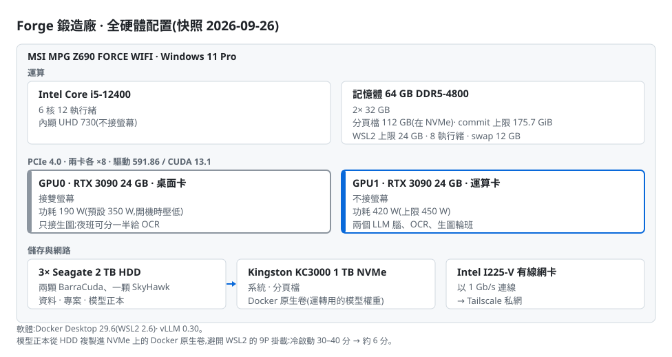
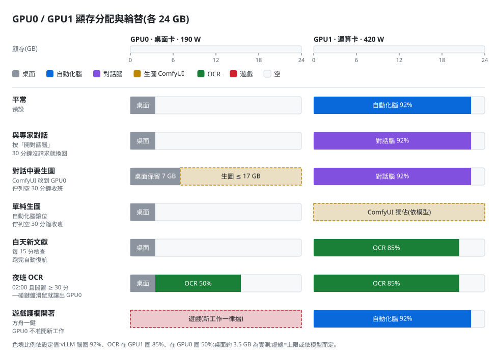

# ChronicleCore 帝國基礎設施 — 硬體配置與節點拓撲

[English](INFRASTRUCTURE.md) · 繁體中文

> **快照日期**:2026-09-26
> **施工期間**:2026-07-04 開工 → 2026-09-25 定型(12 週)
> **用途**:對外說明,並作為日後學術引用的時間點佐證(比照 [v1.0 白皮書快照](../snapshots/v1.0-whitepaper.md) 的做法)
> **揭露原則**:硬體、GPU 配置與機器之間的關係詳細公開;帝國系統與方舟軟體只寫到概念層,細部規格存於私有庫,見文末的雜湊。IP 位址、網域、埠號、憑證、帳號一律不列。節點以代號稱呼。
> **量測原則**:本文的規格都是快照日直接從機器上查到的,不是採購單,也不是憑記憶寫的(方法見文末〈量測方法與來源〉)。

---

## 從一台電腦到一個帝國

[2026-02 的白皮書](../README_zh-TW.md)說明的是「專家怎麼被治理」;這份文件說明的是「那些專家住在哪裡」。

2026-04 上線的 Chronicle-Ark 一代,是跑在單機上的 Agent IDE。2026-07 起,ChronicleCore 擴建成一個由 **4 台常駐機器 + 3 個行動/編譯節點** 組成、以 Tailscale 私網串聯的小型帝國:

- 一座保存正典的**聖殿**
- 一座提供算力的**鍛造廠**
- 一座面對公網的**前哨**
- 一隻獨立於所有被監控機器之外的**看門狗**

全部由消費級硬體與一台退役筆電組成,沒有租用任何 GPU 雲。

---

## 施工時間軸(2026-07 → 2026-09)

| 日期 | 事件 | 佐證 |
|---|---|---|
| 2026-07-04 | **開工**:律法倉(law-repo)與知識圖譜(chronicle-atlas)首次提交 | 兩倉第一筆 commit |
| 2026-07-04 / 05 | 38 位既有專家齊頭遷入 2.0 六層身分結構;同日**思者(鏡)**誕生,是第一位直接以 2.0 結構生成、不經遷移的專家 | 各專家登記卡簽日;思者身分倉第一筆 commit |
| 2026-07-06 | 方舟二代(ark2-app)首次提交 | 第一筆 commit |
| 2026-07-07 | 聖殿重灌上線;39 位專家的身分模組全數推入自架 Gitea | 裝置造冊 |
| 2026-07-08 | 前哨完成加固,第一個對外服務上線 | 裝置造冊 |
| 2026-07-09 | 裝置造冊,定下命名總則(顯示名/主機名/tailnet 名三名綁死) | 裝置造冊 |
| 2026-07-11 | 聖殿 API 成為常駐服務;restic 加密備份第一層上線 | sanctum-api 第一筆 commit |
| 2026-07-12 | PostgreSQL 17 + pgvector 登記簿上線;看門狗上線;embedding 服務首次提交 | 看門狗至快照日連續開機 10 週 5 天 |
| 2026-07-13 | tailnet 七節點齊全 | 裝置造冊 |
| 2026-07-16 | 律法第一版簽章標記 `law-v1` | Git 簽章 tag |
| 2026-07-17 | 本地 vLLM 首次在鍛造廠上線 | 營運紀錄 |
| 2026-07-20 | 推播改為自架 Bark(退役公共推播服務) | 服務定義 |
| 2026-07-21 | OCR 全文補抽管線首次提交 | sanctum-ocr 第一筆 commit |
| 2026-07-22 | embedding 遷到 CPU 常駐,讓出顯存 | 決策紀錄 AD-46d |
| 2026-08-03 | 基礎設施腳本倉(infra)成立 | 第一筆 commit |
| 2026-09-06 | 思者(鏡)注魂,專家增至 39 位 | 登記卡注魂日;日記首篇 |
| 2026-09-06 | 機械閘上線:同一種失敗第二次出現,就用 exit code 擋,不再寫口頭紀律 | 決策紀錄 |
| 2026-09-16 / 19 / 24 | 律法 `law-v2` / `law-v3` / `law-v4` 簽章 | Git 簽章 tag |
| 2026-09-24 | 雙腦制:自動化腦與對話腦分立 | 決策紀錄 D-VLLM-AUTO-01 |
| 2026-09-25 | **定型**:GPU 依需求自動配置、OCR 自動開跑、GPU0 遊戲護欄 | 決策紀錄 D-GPU0-GAME-01 |

### 12 週的提交量(統計至 2026-09-26)

| 倉庫 | 內容 | 首次提交 | 提交數 |
|---|---|---|---:|
| chronicle-lex | 論文與文獻庫(含夜班自動提交) | 07-07 | 478 |
| ark2-app | 方舟二代(Agent IDE) | 07-06 | 430 |
| claude-skills | 技能庫 | 07-12 | 186 |
| chronicle-atlas | 知識圖譜與檢索 | 07-04 | 160 |
| sovereign-biography | 履歷資料庫 | 07-16 | 128 |
| sanctum-api | 聖殿 API | 07-11 | 116 |
| law-repo | 律法(schema 與治理規則) | 07-04 | 103 |
| constitution | 帝國憲法 | 07-12 | 76 |
| infra | 基礎設施腳本 | 08-03 | 60 |
| sanctum-ocr | OCR 管線 | 07-21 | 49 |
| sanctum-embed | embedding 服務 | 07-12 | 11 |
| **合計** | | | **1,797** |

(不含 39 個專家身分倉。)

---

## 節點總覽

<picture>
  <source media="(prefers-color-scheme: dark)" srcset="diagrams/infrastructure-network_zh-TW.dark.svg">
  
</picture>

原始碼:[`diagrams/infrastructure-network_zh-TW.mmd`](diagrams/infrastructure-network_zh-TW.mmd)

| 代號 | 角色 | 硬體(實測) | 作業系統 | 運轉 |
|---|---|---|---|---|
| **Sanctum 聖殿**(E3) | 正典權威、唯一硬依賴 | Intel Xeon E3-1231 v3(4C/8T)· 16 GB DDR3 · 500 GB SATA SSD · GTX 1080(未啟用運算) | Ubuntu 24.04.4 LTS(kernel 6.8) | 24×7 |
| **Forge 鍛造廠** | 主工作站、本地 GPU 算力、方舟 | Intel Core i5-12400(6C/12T)· 64 GB DDR5-4800 · **2× RTX 3090 24 GB** · 1 TB NVMe + 3× 2 TB HDD | Windows 11 Pro + WSL2 / Docker | 常開 |
| **Outpost 前哨** | 唯一公網暴露點 | 雲端 KVM:4 vCPU AMD EPYC · 8 GB · 72 GB | Ubuntu 24.04.4 LTS(kernel 6.8) | 24×7 |
| **Watchdog 看門狗** | 監工、異機備份 | 退役筆電:Intel Core i5-8265U(4C/8T)· 8 GB · 512 GB NVMe · 電池兼 UPS | Ubuntu 24.04.4 LTS(kernel 6.17) | 24×7 |
| **Consul 領事** | 推播終端、行動控制窗、iOS 實機測試 | iPhone | iOS | 隨身 |
| **Atelier 畫室** | 行動寫作工作台 | Android 平板 | Android | 按需 |
| **Studio 工作室** | Apple 編譯手臂 | MacBook Pro(Intel Core i5-1038NG7 · 16 GB) | macOS 26 · Xcode 26.5 | 按需 |

代號 **E3** 取自聖殿的 CPU 系列(Xeon E3)。

### 快照日的機器狀態(2026-09-26)

| 代號 | 網路 | 記憶體 | 系統碟 | 負載 / 溫度 | 連續開機 |
|---|---|---|---|---|---|
| 聖殿 | 有線 GbE(Killer E220x,1000 Mb/s) | 用 1.1 / 15 GiB;swap 4 GiB 未用 | 16 / 455 GB(4%) | 負載 0.3;CPU 41 °C | 2 週 6 天(09-06 事故後重開) |
| 鍛造廠 | 有線(Intel I225-V,1 Gb/s) | commit 用 91.6 / 175.7 GiB | 1 TB NVMe(見專章) | GPU 見專章 | 當日重開 |
| 看門狗 | Wi-Fi(Intel Wireless-AC) | 用 0.8 / 7.5 GiB;swap 4 GiB 未用 | 9 / 98 GB(10%) | 負載 0.00 | 10 週 5 天 |
| 前哨 | 雲端虛擬網卡(virtio) | 用 2.2 / 7.8 GiB;swap 2 GiB | 16 / 72 GB(23%) | 負載 0.6–0.9 | 31 週 4 天 |

---

## 各節點詳述

### 🏛 Sanctum 聖殿(E3)— 正典權威

整個帝國唯一不能死的機器。其他節點倒下都能重建,聖殿保存的是「什麼是真的」。

**職責**
- **正典保存**:39 位專家各自一個 Git 倉(身分模組+日記)、律法倉,全部住在自架 Gitea。
- **聖殿 API**(Python / FastAPI):專家的借出與歸還;借出紀錄存在 PostgreSQL。
- **夜班**:專家的夜間工作(日誌、守望班、文獻整理)由 systemd timer 排程驅動。
- **推播中樞**:自架 Bark server。
- **第一層備份**:restic 端對端加密備份,每日一次,並定期做還原演練。

**守門機制**
- 39 個專家倉都掛了推送閘(pre-receive hook):身分核心檔沒有執政官授權推不進來。
- 專家的記憶只能追加、不能改寫。
- 律法以簽章 tag(`law-vN`)發布,只有執政官持有簽章金鑰;聖殿驗章通過才套用。

**硬體**:Xeon E3-1231 v3(Haswell,4C/8T)裝在 MSI B85-G43 主機板上,16 GB DDR3,500 GB SATA SSD(LVM,根分割 455 GB),有線 Gigabit 乙太網路(Killer E220x)。機箱裡有一張 GTX 1080,沒有裝驅動:聖殿本身不跑模型,需要模型的工作都送往鍛造廠或雲端。快照日記憶體只用了 1.1 GiB,負載 0.3,CPU 41 °C。這台機器的工作量很輕,要求的是穩定。

**軟體**:Ubuntu 24.04.4 · Gitea 1.22(含 Actions runner)· PostgreSQL 17 + pgvector · FastAPI / uvicorn(Python 3.12)· Bark server · restic · Tailscale

### ⚒ Forge 鍛造廠 — 工作站、算力與方舟

執政官的主工作站,也是帝國所有 GPU 算力的所在。

**職責**
- **方舟**(Chronicle-Ark 二代,Electron + React + TypeScript):多引擎 Agent IDE,專家在「房間」裡工作。引擎包括 Claude(Agent SDK)、Codex、Gemini 與本地 vLLM。
- **本地算力**:兩個 LLM 腦、OCR、生圖,詳見〈專章:Forge 的雙 GPU 算力〉。
- **輔助服務**:embedding(bge-m3,CPU 常駐)讓專家做語義檢索。兩隻無頭瀏覽器「手臂」分工:Lightpanda(經 MCP)負責輕量、高頻的公開頁面讀取;Playwright(真 Chromium)負責複雜渲染與檔案下載。聖殿的夜班也經 tailnet 借用 Lightpanda。
- **每日維護**:同步聖殿正典快取、產生專家名冊投影、論文庫體檢。

**方舟是算力的唯一控制介面**:執政官不需要記任何腳本,所有系統操作都在方舟面板上按鈕完成。每個按鈕背後是白名單裡寫死的固定指令,方舟不能執行任意 shell。

**網路**:Intel I225-V 有線網卡(2.5 GbE 晶片,目前以 1 Gb/s 連線)。硬體細節見專章。

**軟體**:Windows 11 Pro · Docker Desktop 29.6(WSL2 2.6)· vLLM 0.30 · Node / Electron · Python · Windows 工作排程器

### 🛰 Outpost 前哨 — 唯一的公網面

帝國所有對外服務都在這裡,也只在這裡。

**職責**
- Caddy 反向代理 + 自動 TLS。目前掛 6 個對外服務:候補名單、履歷資料庫 MCP、書目搜尋 MCP、目錄服務、期刊圖譜 API、精簡版自架 Supabase(Auth / Postgres / PostgREST / Studio)。
- **服務工廠**:新的對外服務只要三步(建骨架 → 編輯 → 部署),自動配專用系統帳號、systemd 自啟與 TLS。

**加固**
- 防火牆預設全擋;公網 SSH 已關閉,只能經 tailnet 登入;fail2ban。
- 每個公網服務的 systemd 單元都禁止連入 tailnet,Docker 容器也被防火牆擋在 tailnet 外。**公網服務就算被攻破,也碰不到聖殿。**

**硬體**:雲端 KVM 虛擬機,4 vCPU(AMD EPYC)、7.8 GiB 記憶體加 2 GB swap、72 GB 磁碟(用了 23%)。常駐 6 個容器;Caddy、fail2ban、ufw 三個服務常駐。這台 VPS 比帝國早:快照日已連續開機 31 週 4 天,2026-07 才加固,成為前哨。

### 🐕 Watchdog 看門狗 — 監工與異機備份

設計原則:**監控者不能住在被監控的機器上。** 所以看門狗是一台獨立的退役筆電:螢幕壞了,改成 headless 運轉,電池就是現成的 UPS。

**職責**
- **巡檢**(約每 5 分鐘):
  - 聖殿 API 健康,加上一個「死人開關」:服務活著卻整夜零產出的靜默失敗也抓得到。
  - 實際以 SSH 登入聖殿一次,確認機器本身能進得去(見下文〈活著不等於健康〉)。
  - 鍛造廠在線、前哨在線、三個對外營運站點。
  - 連續兩次異常才告警,恢復時也通知,平常保持安靜。
- **心跳**:早上 9 點、晚上 9 點各報一次時,證明看門狗自己還活著。
- **第二層備份**:每天 05:00 把聖殿的加密備份庫鏡像過來。聖殿整台死掉,資料也不會全失。
- **獨立推播出口**:看門狗本機跑一份自己的 Bark server(只聽本機),不經過聖殿。聖殿倒下時,「聖殿倒了」這則告警照樣送得到手機。

**硬體**:Core i5-8265U(Whiskey Lake,4C/8T)、8 GB、512 GB NVMe(根分割 98 GB,用了 9 GB)。內顯 UHD 620 與獨顯 MX250 都閒置不用。沒有有線網路,只走 Wi-Fi。電池充放過 95 次,滿電 40.8 Wh,原廠設計 47.1 Wh(健康度 86.6%)。

自 2026-07-12 上線後連續運轉,快照日已開機 10 週 5 天。

### 📱 行動與編譯節點

這三個節點不常駐,它們把帝國延伸到書桌之外,也把 Apple 平台接了進來。

- **Consul 領事**(iPhone):接收所有 Bark 推播,也是經 tailnet 查看聖殿與方舟的行動窗口。它同時是 iOS 的實機測試機:手機本身就在 tailnet 上,開發中的 app 可以直接經 tailnet 連回帝國做測試,不必和開發機在同一個區網,人在外面也能測。
- **Atelier 畫室**(Android 平板):行動寫作工作台,離開書桌時寫論文,經 tailnet 連回帝國。
- **Studio 工作室**(Intel MacBook Pro · macOS 26 · Xcode 26.5):帝國通往 Apple 平台的入口。原生 iOS app(Swift)的編譯、簽章與上架只能在 Mac 上做;Expo app 也在這裡本地編譯(`eas build --local`),不消耗雲端編譯額度。鍛造廠經 tailnet 以 SSH 遠端驅動整條流程,編譯期間自動防休眠。在 Windows 寫碼,在 Mac 編譯,在 iPhone 上測。

### 🔒 非公開基礎建設:執政官卷宗

不對外開放、但每次對外寫作都會用到的一項服務。

- **卷宗**:一份以「事實」為單位的個人資料庫,記錄職務、學歷、論文狀態、專案起訖等。每筆事實標明權威來源:論文狀態以文獻庫為準,其餘以卷宗帳本為準。
- **對外可公開的事實簡報**:卷宗依「公開視角」產生一份快照,放在前哨上的 MCP 服務(OAuth 2.1 授權,端點不公開)。帝國裡任何人寫網站、簡介、履歷或求職信之前,先讀這份簡報。
- **事實不是文案**:簡報只給事實與對外口徑的界線,文字由寫的人自己寫;簡報裡沒有的事,就是不對外。發現新事實時不直接寫入,而是提交到待審佇列,由執政官核可。
- 服務提供 11 個工具:讀簡報與結構化事實、讀寫履歷區塊、產出履歷與求職信、提議新事實。

這份文件裡的作者頭銜與論文狀態,就是 2026-09-26 從這份簡報取得的。

---

## 串聯方式與互動關係

### 網路:一張 tailnet,兩道隔離

- 所有節點以 Tailscale(WireGuard)組成私網 mesh,彼此只經 tailnet 互通,不依賴區網。聖殿與鍛造廠甚至不在同一個區網網段,tailnet 是它們之間唯一的路。
- 聖殿的服務(Gitea、API、Bark)只在 tailnet 上接收請求,公網入口為零。
- 前哨是唯一對公網開門的機器,而它的公網服務被禁止回頭連進 tailnet。

### 實測路徑與延遲

2026-09-26 以 `tailscale ping` 在各節點之間互量。六條路徑全部是點對點直連,沒有一條落到 Tailscale 的中繼伺服器(DERP)上。

| 路徑 | 連線 | 往返延遲 | 這條路上跑什麼 |
|---|---|---|---|
| 鍛造廠 ↔ 聖殿 | 直連(IPv6),兩端都是有線 | **2–3 ms** | 專家借出與歸還、正典同步、夜班送本地模型的工作 |
| 聖殿 ↔ 看門狗 | 直連;看門狗走 Wi-Fi | 7–119 ms(中位數約 23 ms) | 備份鏡像、健康巡檢 |
| 鍛造廠 ↔ 看門狗 | 直連;看門狗走 Wi-Fi | 4–86 ms(兩輪中位數約 4 ms 與 24 ms) | 健康巡檢 |
| 鍛造廠 ↔ 前哨 | 跨洲直連 | 282–314 ms(中位數約 303 ms) | 部署、維運 |
| 聖殿 ↔ 前哨 | 跨洲直連 | 302–306 ms | 兩者之間沒有業務往來 |
| 看門狗 ↔ 前哨 | 跨洲直連 | 301–331 ms(中位數約 329 ms) | 健康巡檢 |
| 鍛造廠 ↔ 領事 | 直連(行動裝置;直連建立前先經中繼) | 3–100 ms | 行動端查看、iOS 實機測試 |

延遲的分布跟職責對得上:需要頻繁來回的借出、歸還與夜班,走的是 3 ms 以內的有線直連;跨洲的前哨只負責對外服務,與帝國內部沒有高頻往來。看門狗的延遲抖動來自 Wi-Fi,對 5 分鐘一次的巡檢沒有影響。

### 依賴關係:誰倒下會怎樣

| 倒下的是 | 影響 | 誰會發現 |
|---|---|---|
| **聖殿** | 專家無法借出與歸還;夜班停擺;正典改不動 | 看門狗巡檢(連續兩次異常)→ 看門狗自己的 Bark,不經聖殿 |
| **鍛造廠** | 方舟與本地算力停擺;聖殿夜班照常,需要本地模型的工作延後或改道,需要上網的工作暫停 | 看門狗巡檢 → Bark |
| **看門狗** | 監控失明,第二層備份暫停 | 早晚 9 點的心跳沒有準時出現 |
| **前哨** | 對外服務中斷;帝國內部不受影響 | 看門狗只能確認機器與 tailnet 在線(見〈已知限制〉) |

聖殿是唯一的硬依賴:鍛造廠、看門狗、前哨任何一台倒下,其餘機器都照常運作;聖殿倒下,專家就停工。所以聖殿的資料有兩層備份,它的告警也有一條不經過它自己的出口。

### 活著不等於健康

2026-09-01,聖殿發生核心 oops:tailscaled 列舉網卡時觸發核心錯誤,網路堆疊的一把鎖被一條已死的執行緒永久握住。之後 Gitea 與聖殿 API 的 HTTP 全程回 200,其他行程卻一個個卡死,SSH 連線逐漸被拒。當時的監看只問 HTTP,所以這場退化持續了四天沒人發現,最後只能到實體主控台強制重開。

留下的機制:

- 核心 oops 後 30 秒自動重開。
- 聖殿每小時自查核心層:失敗的 systemd 單元、核心日誌裡的 oops / lockup / 卡死行程。
- 看門狗每 5 分鐘實際 SSH 登入聖殿一次;鍛造廠每天再從另一個角度查一次。

同一個教訓在鍛造廠又出現一次。2026-09-09,Lightpanda 卡在一個沒關的分頁裡的無限迴圈,CPU 空燒了兩天;它的看護只看 HTTP 有沒有回應,全程顯示健康。看護後來加了第二個判準:HTTP 還活著、CPU 卻連續 30 分鐘高於 80%,就視為空燒並自動重啟。

監看要從使用者實際走的那條路去探,光看服務回應碼不夠。

### 資料流

<picture>
  <source media="(prefers-color-scheme: dark)" srcset="diagrams/infrastructure-dataflow_zh-TW.dark.svg">
  
</picture>

原始碼:[`diagrams/infrastructure-dataflow_zh-TW.mmd`](diagrams/infrastructure-dataflow_zh-TW.mmd)

| 流向 | 內容 | 方式 |
|---|---|---|
| 方舟(鍛造廠)→ 聖殿 API | 借出與歸還專家 | tailnet |
| 聖殿 Gitea → 鍛造廠 | 每日同步正典快取(專家身分、律法) | Git |
| 聖殿夜班 → 鍛造廠 vLLM | 夜班的部分例行工作交給本地模型 | OpenAI 相容 API over tailnet |
| 聖殿夜班 → 鍛造廠 Lightpanda | 夜班需要上網時,借用鍛造廠的瀏覽器 | tailnet |
| 聖殿 → 看門狗 | restic 加密備份庫每日鏡像 | tailnet |
| 看門狗 → 聖殿、鍛造廠、前哨 | 健康巡檢、SSH 登入探測 | tailnet |
| 聖殿、鍛造廠 → 聖殿 Bark → 領事 | 夜班收班報告、GPU 事件、告警 | Bark → Apple 推播服務 |
| 看門狗 → 看門狗本機 Bark → 領事 | 巡檢告警、早晚心跳 | 同上;不經聖殿 |
| 鍛造廠 → 工作室 | 遠端編譯(iOS / Expo) | SSH over tailnet |
| 領事 → 鍛造廠 | iOS 實機測試:開發中的 app 直接連回帝國 | tailnet |
| 公網 → 前哨 | 對外服務 | HTTPS(Caddy 自動 TLS) |
| 執政官 → 聖殿 | 律法發布 | 簽章 tag → 驗章後套用 |

### 備份的三層

| 層 | 位置 | 目的 | 狀態 |
|---|---|---|---|
| 第一層 | 聖殿本機 restic 加密庫(每日;保留 日 7 / 週 4 / 月 6;快照日 1.4 GB) | 誤刪、壞檔 | ✅ 運轉中 |
| 第二層 | 看門狗鏡像(每日 05:00) | 聖殿整台故障 | ✅ 運轉中 |
| 第三層 | 離線冷備帶離現場 | 地點級災難 | 規劃中 |

備份採端對端加密,放在自有機器上,不放第三方雲。

---

## 系統工具

| 工具 | 用途 | 部署位置 |
|---|---|---|
| **Tailscale** | 私網 mesh、節點身分、跨網段互通 | 全部節點 |
| **Bark** | iOS 推播 | 自架兩份:聖殿一份(只在 tailnet 上收請求)、看門狗一份(只聽本機,聖殿倒下時的獨立出口);都經 Apple 推播服務送到手機 |
| **Gitea**(+ Actions runner) | 正典 Git 主機、推送閘、CI | 聖殿 |
| **PostgreSQL 17 + pgvector** | 租約登記簿、向量 | 聖殿 |
| **restic** | 端對端加密備份,兩層 | 聖殿、看門狗 |
| **Caddy** | 反向代理 + 自動 TLS | 前哨 |
| **Docker** | vLLM 與瀏覽器容器;精簡版 Supabase | 鍛造廠、前哨 |
| **systemd timer / Windows 工作排程器** | 夜班、巡檢、看護 | 全部常駐節點 |
| **機械閘** | 開發側的 hook:推送前掃密鑰、擋危險指令。同一種失敗第二次出現,就建閘 | 鍛造廠 |

---

## 專章:Forge 的雙 GPU 算力

<picture>
  <source media="(prefers-color-scheme: dark)" srcset="diagrams/forge-hardware_zh-TW.dark.svg">
  
</picture>

原始資料:[`diagrams/forge-hardware.draw.json`](diagrams/forge-hardware.draw.json)

### 硬體

| 項目 | 規格(實測) |
|---|---|
| CPU | Intel Core i5-12400(6C/12T) |
| 主機板 | MSI MPG Z690 FORCE WIFI |
| 記憶體 | 64 GB DDR5-4800(2× 32 GB) |
| 分頁檔 | 112 GB,放在 NVMe 上;commit 上限 175.7 GiB,快照日用了 91.6 GiB |
| **GPU0** | NVIDIA RTX 3090 24 GB:**桌面卡**(接雙螢幕)。預設功耗 350 W,由系統層排程在開機時壓到 **190 W** |
| **GPU1** | NVIDIA RTX 3090 24 GB:**運算卡**。預設功耗 420 W(上限 450 W),維持 420 W |
| 兩卡差異 | vBIOS 版本與預設功耗都不同 |
| PCIe | 兩卡各 ×8,最高 Gen 4;閒置時鏈路自動降速(快照日 GPU0 在 Gen 2、GPU1 在 Gen 1) |
| 驅動 | NVIDIA 591.86 · CUDA 13.1 |
| 內顯 | Intel UHD 730(不接螢幕) |
| 系統碟 | Kingston KC3000 1 TB NVMe:系統、分頁檔、Docker 原生卷 |
| 資料碟 | 3× Seagate 2 TB SATA HDD(兩顆 BarraCuda、一顆 SkyHawk):資料、專案、模型正本 |
| 網路 | Intel I225-V 有線,1 Gb/s |
| 容器 | Docker Desktop 29.6 · WSL2 2.6 · vLLM 0.30 |
| WSL2 上限 | 記憶體 24 GB、8 個處理器、swap 12 GB;閒置時主動釋放頁快取 |

模型正本放在資料碟;運轉用的權重複製進 Docker 原生卷(ext4)。原因是 WSL2 跨界掛載 Windows 路徑要走 9P 協定,vLLM 冷啟動會從 30–40 分鐘拖不完,換成原生卷後降到約 6 分鐘(2026-07-22 實測)。

### 記憶體:真正的牆是 commit

在 Windows 上用 WSL2 + Docker 跑 vLLM,最先撞到的是 commit 上限(實體記憶體加分頁檔)。原因有兩個:

- WSL 裡的模型用掉多少顯存,主機就要在 commit 帳上記一筆等量。
- vLLM 冷啟動讀權重時,頁快取會把 WSL 的記憶體撐到上限,載完也不會自己還。

所以 2026-08-23 那晚,實體記憶體還空著 23 GB,系統卻連報六次「虛擬記憶體不足」。現在的配置:

- 分頁檔 112 GB,放在 NVMe。2026-08-10 以前分頁檔在機械硬碟上,一旦大量換頁,整台機器會凍住幾分鐘。
- WSL2 記憶體上限 24 GB,閒置時主動釋放頁快取。
- 任何腦啟動前,啟動閘先估算冷啟動的 commit 尖峰,放不下就不啟動(2026-09-22 起)。

### 顯存快照(2026-09-26)

| 卡 | 顯存 | 功耗 | 溫度 | 此刻在上面的 |
|---|---|---|---|---|
| GPU0 | 3,551 / 24,576 MiB | 52 W | 58 °C | 只有桌面 |
| GPU1 | 23,416 / 24,576 MiB | 12 W(待命) | 34 °C | 自動化腦(vLLM 啟動時就圈定顯存) |

### GPU 上的住戶

| 住戶 | 模型 | 位置 | 規格與實測 |
|---|---|---|---|
| **自動化腦** | Qwen3.8-27B(AWQ W4A16) | GPU1 | 32K context · 44–46 tok/s · 服務聖殿夜班的書記工作 |
| **對話腦** | Qwen3.8-27B 無審查社群微調版(AWQ W4A16) | GPU1 | 56K context(fp8 KV cache)· 42–43 tok/s · 工具呼叫約 1.5 秒 · 執政官與專家對話時才開 |
| **OCR** | baidu Unlimited-OCR(vLLM) | GPU1(夜間閒置時可雙卡) | 文獻全文抽取,帳本累計 346 份 |
| **生圖** | ComfyUI · Krea 2 / Qwen-Image 2.1 | 依腦的位置決定(見下) | 13 個模型檔,共 68.8 GiB |
| **embedding** | BAAI bge-m3(1024 維) | **CPU** | 2026-07-22 遷出 GPU,換到零顯存衝突 |
| **瀏覽器手臂(輕)** | Lightpanda(MCP) | CPU(容器) | 公開頁面讀取;專家與聖殿夜班共用 |
| **瀏覽器手臂(重)** | Playwright(Chromium) | CPU(容器) | 複雜渲染、檔案下載 |

兩個腦共用同一個 API 端點,同一時間只會有一個在跑(原因見〈已知限制〉)。聖殿的夜班只認自動化腦的模型名,所以夜班工作永遠不會送到對話腦。

2026-09-25 以前,對話腦是跨兩張卡的 MoE 模型。改成單卡 27B 之後,GPU0 才得以完全交還給桌面與生圖。

#### vLLM 啟動參數

| 參數 | 自動化腦 | 對話腦 |
|---|---|---|
| 權重 | Qwen3.8-27B,AWQ W4A16 非對稱量化 | 同一基座的無審查微調版,同樣量化 |
| context 上限 | 32,768 | 57,344 |
| 顯存占比 | 0.92 | 0.92 |
| KV cache | 預設精度 | fp8 |
| 同時序列上限 | 4 | 4 |
| 並行 | 單卡,綁 GPU1 | 單卡,綁 GPU1 |
| 工具呼叫 / 推理解析 | qwen3_xml / qwen3 | qwen3_xml / qwen3 |
| 只載語言模型(不載視覺編碼器) | 是 | 是 |
| 對外模型名 | 兩個:自己的名字 + 與對話腦共用的名字 | 一個:共用的名字 |

綁卡只認 `CUDA_VISIBLE_DEVICES`。2026-09-25 的實案:只給 Docker 指定裝置(`--gpus device=1`)時,模型照樣載進了 GPU0。

兩個腦的權重各 19.6 GB,分別放在自己的 Docker 原生卷;另有 2.2 GB 的編譯快取卷。vLLM 映像 30.7 GB,OCR 映像 27.7 GB。

#### 吞吐量實測

| 工作 | 實測 | 條件 |
|---|---|---|
| 自動化腦 | 44–46 tok/s | 2026-09-24/25 上線驗收 |
| 對話腦 | 42–43 tok/s;工具呼叫約 1.5 秒 | 同上 |
| OCR | 頁數加權平均 **1.62 秒/頁**(各批中位數 1.85,範圍 1.0–3.6) | 07-23 → 09-26 有收班紀錄的 28 批,共 292 份、25,007 頁;含單卡與夜間雙卡 |
| 生圖(GPU0,限制模式) | 每張約 390–520 秒,零驅動錯誤 | 2026-09-25 驗收 |
| 生圖(GPU1) | 每張中位數約 17 秒(6 張) | 快照日這一輪;工作流與 GPU0 驗收時不同,兩者不能直接相比 |

### 協調原則:換班,而不是硬擠

vLLM 的顯存在啟動那一刻就圈定,之後即使閒置也不會吐回來。所以「等它閒下來再塞別的東西進去」行不通。帝國的算力分配原則:

- **常駐 × 常駐衝突 → 換裝置**。例:embedding 從 GPU 搬到 CPU。
- **常駐 × 批次衝突 → 換時間**。例:OCR、生圖與腦輪班使用 GPU1。

落實成四個機制:

1. **換班鎖**:一把跨行程的檔案鎖,OCR、ComfyUI、方舟共用。拿著鎖的人用卡;超過 8 小時沒釋放,視為殘留。
2. **啟動閘**:任何腦啟動前,先量每張卡的可用顯存與系統 commit 餘裕。不夠就不啟動,並點名是誰佔著。不啟動就不會燒。
3. **依需求自動配置**(2026-09-25 定型),見下表。
4. **看護排程**,見下下表。

#### 誰在哪張卡

| 情境 | GPU0(桌面卡,190 W) | GPU1(運算卡) |
|---|---|---|
| 平常 | 桌面 | 自動化腦 |
| 執政官與專家對話 | 桌面;要生圖時 ComfyUI 上這張 | 對話腦 |
| 單純生圖(沒有對話) | 桌面 | ComfyUI 獨佔,自動化腦讓位 |
| 新文獻進來(白天) | 桌面 | OCR,腦讓位;跑完自動復航 |
| 夜班 OCR(閒置 ≥ 30 分) | OCR 只用半張;有人一碰鍵盤滑鼠就立刻讓出 | OCR |
| 遊戲護欄開著 | 遊戲;任何新工作一律擋下並推播 | 照常 |

GPU0 只接生圖,影片、LLM 與白天的 OCR 一律不上 GPU0。在 GPU0 上生圖時帶三道限制:關閉 pinned memory、保留 7 GB 顯存給桌面、功耗 ≤ 190 W。OCR 在 GPU1 圈 85% 顯存;夜班動用 GPU0 時只圈 50%。

<picture>
  <source media="(prefers-color-scheme: dark)" srcset="diagrams/gpu-vram_zh-TW.dark.svg">
  
</picture>

原始資料:[`diagrams/gpu-vram.draw.json`](diagrams/gpu-vram.draw.json)

#### 例:按下「開對話腦」

<picture>
  <source media="(prefers-color-scheme: dark)" srcset="diagrams/gpu-chat-brain_zh-TW.dark.svg">
  
</picture>

原始碼:[`diagrams/gpu-chat-brain_zh-TW.mmd`](diagrams/gpu-chat-brain_zh-TW.mmd)

結果:專家邊聊邊畫,執政官不用手動切換任何東西。

#### 看護排程

| 看護 | 節奏 | 做什麼 |
|---|---|---|
| vLLM 看護 | 每 10 分 | 腦陷入崩潰迴圈就停掉,防止空燒;對話腦 30 分鐘沒有請求,自動換回自動化腦 |
| ComfyUI 閒置收班 | 每 10 分 | 佇列空了 30 分鐘就收班,讓腦回來 |
| OCR 自動開跑 | 每 15 分 | 有新文獻待抽、卡又空著,就在 GPU1 開跑;同一份清單 12 小時內只自動跑一次 |
| OCR 夜班 | 每日 02:00 | 看實際的最後輸入時間判斷是否真閒置,不猜作息;閒置 ≥ 30 分才動用 GPU0 的一半 |
| GPU0 功耗上限 | 開機時 | 把桌面卡壓到 190 W |
| 遊戲護欄 | 方舟一鍵 | 開著時 GPU0 不准開新工作;被擋下的工作會推播通知 |

方舟的算力面板把這些狀態攤在一個畫面上:兩張卡的即時用量、現在是哪個腦、一鍵換腦、遊戲護欄、OCR 批次與收班。

### 事故驅動的設計

上面每一道限制都對應一次真實事故:

| 日期 | 事故 | 留下的機制 |
|---|---|---|
| 2026-07-21 | OCR 批次雙卡滿載,桌面卡的顯存被擠滿,桌面卡頓數小時 | 批次工作只綁 GPU1 |
| 2026-07-22 | 深夜仍有人在用電腦,OCR 用滿 GPU0 → 整機當機 | 以實際輸入判斷閒置;GPU0 哨兵;GPU0 只用一半 |
| 2026-08-10 | vLLM 冷啟動把 WSL 記憶體撐到上限,換頁打在機械硬碟 → 整機凍結數分鐘 | WSL 閒置時釋放快取;分頁檔搬到 NVMe |
| 2026-08-23 | 實體記憶體還空 23 GB,一晚連報六次「虛擬記憶體不足」:撞的是 commit 上限 | 分頁檔擴大;WSL 上限 24 GB;把顯存計入記憶體預算 |
| 2026-09-09 / 09-15 | vLLM 子行程死後,另一張卡忙等空燒,26 小時沒人發現 | 崩潰迴圈偵測即停;啟動前顯存閘;看護告警 |
| 2026-09-15 | 兩卡在 Windows 下處於 SLI 連結模式,桌面的顯存配置整份鏡像到運算卡,吃掉約 3.5 GB | 顯存閘保留 1 GB 餘裕,不夠時點名佔用者(09-22 再量,兩卡已各自獨立) |
| 2026-09-22 | 顯存看起來夠,vLLM 冷啟動卻 OOM:真正的牆是主機 commit | 啟動閘加上 commit 尖峰估算 |
| 2026-09-25 | 只給 Docker 指定裝置,模型仍載進 GPU0 | 綁卡一律用 `CUDA_VISIBLE_DEVICES` |
| 2026-09-25 | 影片生成在桌面卡上長時間滿載 → 藍屏 | GPU0 只准生圖;功耗 190 W;保留 7 GB;遊戲護欄 |

---

## 已知限制(2026-09-26)

- 聖殿、鍛造廠、看門狗同在一處,真正異地的只有雲端前哨。
- 看門狗在家裡網路之後,探不到前哨的公網服務層,目前只能證明前哨「機器與 tailnet 活著」。
- 聖殿只有 16 GB 記憶體,向量庫擴大時會是瓶頸。
- 兩個腦不能同時開,原因有兩層。第一層是顯存:GPU0 保留給桌面與生圖,兩個腦都只能住 GPU1。第二層是主機記憶體:鍛造廠只有 64 GB(2× 32 GB),而每個腦在 WSL 裡用掉的顯存(約 23 GB),主機都要在 commit 帳上記一筆等量。2026-09-22 要讓 vLLM 同時佔用兩張卡時,啟動閘估算的 commit 尖峰是 140.1 GiB,比當時的上限 127.7 GiB 多出 12.4 GiB。所以執政官對話時自動化腦不在,夜班裡需要本地模型的工作要等它回來。

---

## 量測方法與來源

| 項目 | 方法 |
|---|---|
| Forge 硬體 | PowerShell `Get-CimInstance`(Win32_Processor / Win32_PhysicalMemory / Win32_BaseBoard / Win32_PageFileUsage)、`Get-PhysicalDisk`、`Get-Volume`、`Get-NetAdapter` |
| GPU | `nvidia-smi --query-gpu`(驅動、vBIOS、功耗上限、顯存、溫度、PCIe 鏈路) |
| Linux 節點 | SSH 進機器執行 `hostnamectl`、`lscpu`、`lspci`、`free -h`、`df -h`、`uptime -p`、`/proc/loadavg`、`sensors`、`systemctl`;看門狗電池用 `upower` 與 sysfs |
| 節點清單與路徑 | `tailscale status --json`(只取主機名、作業系統、連線方式);`tailscale ping`(各節點之間互量) |
| 時間軸與提交量 | 各倉 `git log --reverse` 的第一筆、`git rev-list --count HEAD`;律法 tag 的建立日期 |
| 模型與參數 | `docker inspect` 的啟動參數(金鑰除外);吞吐量為 2026-09-24/25 上線驗收時實測 |
| OCR 吞吐 | OCR 每批收班紀錄的份數、頁數與每頁秒數,以頁數加權 |
| 事件 | 帝國內部決策紀錄(DECISIONS)、裝置造冊、事故紀錄 |

---

帝國系統與方舟軟體的細部規格(租約流程、夜班分流等)存於私有庫。2026-09-26 詳細版的 SHA-256:`a1b3755f711bc991841e9e18e23ca4e56eabe3604f1e61ad0ec2ba2bbe63995a`(以 LF 換行、UTF-8 計算)。

---

> **Built and Designed by:**
> 李孟翰 Meng-Han (Martin) Lee (Zaious) — ChronicleCore 系統架構師 · 獨立研究者暨 AI 顧問 · [ORCID 0009-0007-1685-0877](https://orcid.org/0009-0007-1685-0877)
>
> *Assisted by the ChronicleCore expert council*
