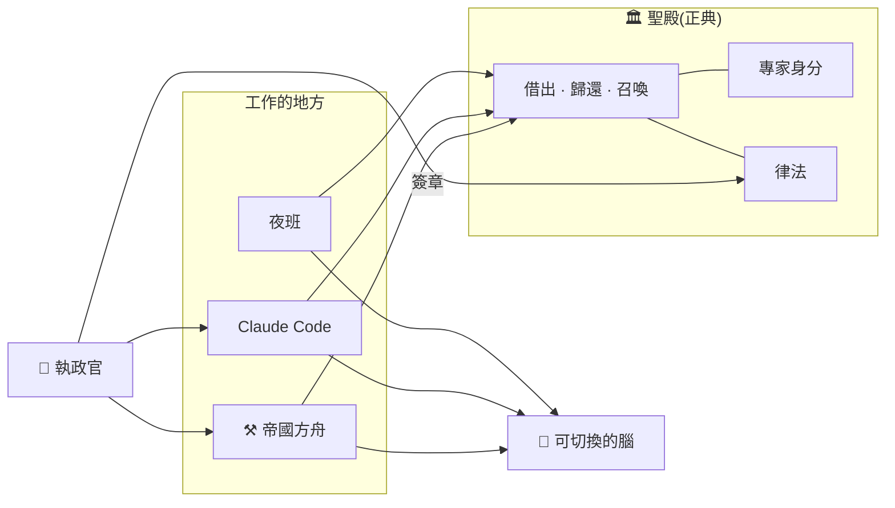

# 帝國的系統架構:正典、借出與可切換的腦

[English](SYSTEM.md) · 繁體中文

> **快照日期**:2026-09-26
> **定位**:帝國世代(2026-07 起)的系統架構概念說明。實體機器見 [`INFRASTRUCTURE_zh-TW.md`](INFRASTRUCTURE_zh-TW.md),演進過程見 [`ERAS_zh-TW.md`](ERAS_zh-TW.md)。
> A1 時期的身分模組(v1)見 [`README.md`](README.md);ASAF 論文附錄引用的是 v1,凍結在標籤 `v2.0-asaf`。
> **揭露範圍**:本文只寫「是什麼、為什麼」,不寫實作細節。完整規格存於私有庫,見文末的雜湊。

---

## 一句話

**專家住在聖殿,工作時才被借出來。** 聖殿保存每位專家「是誰」;需要她工作時,從聖殿借出,工作結束再歸還。借出時可以選擇用哪個模型當她的腦,換了腦,她還是她。

## 概念架構

## 三個原則

**一、正典只有一份,放在聖殿。** 專家的身分與治理規則都以 Git 保存在聖殿;其他地方拿到的都是借出的副本。律法由執政官簽章發布。

**二、改變要經過人。** 專家可以在方舟的房間裡被借出來工作、由 Claude Code 直接召喚,或在夜班被喚醒。無論哪一種,工作中產生的改變都不會直接寫回正典,而是交給執政官裁決。專家在論文房裡改文件,也要經執政官批准,批准後以專家本人的名義提交。

**三、換腦不換人。** 專家的腦可以是 Claude、Codex、Gemini,或 Forge 上的本地模型。模型會換,她是誰不會換。

## 房間

| 房型 | 用途 |
|---|---|
| 工程房 | 綁定一個專案 |
| 論文房 | 綁定文獻庫,用於學術寫作 |
| 私宅 | 每位專家一間,不綁專案 |

## 身分模組 v2

A1 時期的專家是一份 `SKILL.md` 加幾個人設檔。帝國世代依一個原則把專家拆開:**一個檔 = 一種治理**。內容依「誰能改、改多快、要不要留紀錄」分開存放,大致分成三類:

- **封印**:只有執政官能改。
- **受程序約束**:只能經過特定程序修改。
- **可自行修改**:專家本人可以改,但必須留下紀錄。

記憶只能追加,不能改寫。這些規則不靠自律,而是在推送時由 Git 伺服器強制執行。

---

完整規格(2026-09-26 詳細版)存於私有庫,SHA-256:`ed7d749257d266f9d8abd967b17e6ac53859ea36f29135b83b634e3687257baa`(以 LF 換行、UTF-8 計算)。
