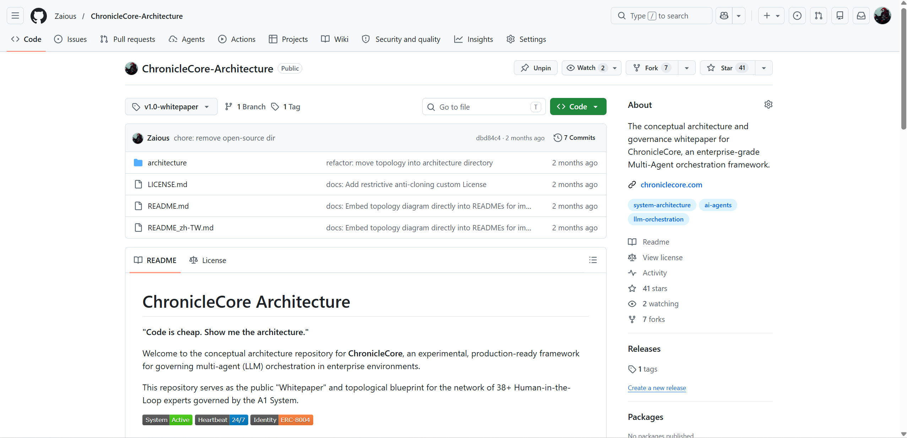

# Architecture Snapshots

Frozen copies of the ChronicleCore Architecture at major milestones. Each snapshot preserves the exact state of the architecture document at that point in time.

For git-level verification, each snapshot corresponds to a tagged release.

---

## v1.0 — Original Whitepaper (2026-02-22)

| Item | Link |
|------|------|
| **Git Tag** | [`v1.0-whitepaper`](https://github.com/Zaious/ChronicleCore-Architecture/tree/v1.0-whitepaper) |
| **README (frozen)** | [v1.0-whitepaper.md](v1.0-whitepaper.md) |
| **Topology (frozen)** | [v1.0-topology.md](v1.0-topology.md) |

---

## Evidence: Antigravity Skills Chronicle (2026-04-20)

4,330+ downloads on Open VSX Registry at time of open-source release.

---

## Why Snapshots?

This architecture is referenced in academic publications. Snapshots provide an accessible, human-readable record that doesn't require git knowledge to verify. The tagged releases serve as the authoritative source; these files are convenience copies.
