# ChronicleCore Architecture

**"Code is cheap. Show me the architecture."**

Welcome to the conceptual architecture repository for **ChronicleCore**, an experimental, production-ready framework for governing multi-agent (LLM) orchestration in enterprise environments.

This repository serves as the public "Whitepaper" and topological blueprint for the network of 38+ Human-in-the-Loop experts governed by the A1 System.

## 🌐 Read in other languages
* [繁體中文 (Traditional Chinese)](README_zh-TW.md)

---

## The Core Philosophy: Context Governance

*   **You don't manage AI models; you manage their organizational charts.**
*   A single agent is an assistant. Ten agents are a task force. Thirty-eight agents are a multinational enterprise.
*   Let an Execution Agent make strategic decisions, and it hallucinates. Therefore, we ensure **Physical Separation of Duties**.

## The 5 Pillars of Governance

To prevent cognitive overload and persona drift during multi-agent orchestration, ChronicleCore is decoupled into 5 strict pillars:

1.  **👑 The Core (Strategy)**: (e.g., The Architect) Routes global context. Strictly prohibited from writing base-level code.
2.  **👁️ The Senses (Intelligence)**: (e.g., Intelligence Officer) Scrapes market trends and external data. The sole vision entry point.
3.  **🎭 The Soul (Aesthetics)**: (e.g., Chief Marketing Officer) Handles emotional anchoring, rhetoric audits, and UX design.
4.  **🔨 The Hands (Execution)**: (e.g., Data Scientist) Executes purely within the boundaries established by the Core and Senses.
5.  **🛡️ The Shield (Defense)**: (e.g., The Inquisitor) The internal auditor machine-gunning logical loopholes from the Senses. Zero data enters the memory core without surviving a consensus debate.

## Architecture Blueprint

```mermaid
graph TD
    %% Styling Definition (Premium Dark Mode Vibe)
    classDef sovereign fill:#0d1117,stroke:#ff6b6b,stroke-width:3px,color:#fff,font-weight:bold;
    classDef trinity fill:#2d1b2e,stroke:#a64d79,stroke-width:2px,color:#fff;
    classDef sense fill:#0a2540,stroke:#2980b9,stroke-width:2px,color:#e0f7fa;
    classDef intel_special fill:#0a2540,stroke:#00e5ff,stroke-width:3px,color:#fff,stroke-dasharray: 4 4;
    classDef creation fill:#2a1b2b,stroke:#8e44ad,stroke-width:2px,color:#f3e5f5;
    classDef execution fill:#0d2613,stroke:#27ae60,stroke-width:2px,color:#e8f5e9;
    classDef shadow fill:#1a0505,stroke:#e74c3c,stroke-width:2px,color:#ffebee;
    classDef inq_special fill:#1a0505,stroke:#ff3333,stroke-width:3px,color:#fff,stroke-dasharray: 4 4;

    %% Sovereign Layer
    SOV["👑 Zaious (Sovereign)<br/>(Human-in-the-Loop Controller)"]:::sovereign

    %% Subgraph for the whole network to give a containment feeling
    subgraph A1_Network ["ChronicleCore: Multi-Agent Orchestration Framework"]
        direction TB
        
        subgraph TR_GRP ["1. The Core: Trinity Council"]
            direction LR
            TR_ARCH["樞機師 (Architect)<br/>✦ Topology Designer ✦<br/>System Architecture & Routing"]:::trinity
            TR_COS["幕僚長 (Chief of Staff)<br/>✦ Strategy Filter ✦<br/>Goal Translation & Validation"]:::trinity
            TR_CPO["星探 (People Officer)<br/>✦ Personnel Arbiter ✦<br/>Skill Audit & Agent Forge"]:::trinity
            
            TR_ARCH ~~~ TR_COS ~~~ TR_CPO
        end

        subgraph SENSE_GRP ["2. The Senses: Intelligence Bureau"]
            direction TB
            INT_PRIME["天機星 (Officer Intelligence)<br/>✦ The Gate of Secrets ✦<br/>All Intel & OSINT Entry Point"]:::intel_special
            INT_REST["Other Analytical Nodes<br/>(Market, Data & Prediction)"]:::sense
            
            INT_PRIME -.->|Filtered Context| INT_REST
        end
        
        ART["3. The Soul: Creative Atelier<br/>UX, Personality & Aesthetic Vibe<br/>[5 Generative Nodes]"]:::creation
        
        EXE["4. The Hands: Build Factory<br/>Engineering, Database & DevOps<br/>[8 Executable Nodes]"]:::execution

        subgraph SHD_GRP ["5. The Shield: Shadow Guard"]
            direction TB
            SHD_INQ["真理 (Officer Inquisitor)<br/>✦ The Heresy Judge ✦<br/>Audit & Machine Gun Debate"]:::inq_special
            SHD_REST["Shadow & InfoSec<br/>(Guardrails & Containment)"]:::shadow
            
            SHD_INQ ~~~ SHD_REST
        end

        %% Main Flow
        TR_GRP == "Recon Directives" ==> INT_PRIME
        TR_GRP == "Style Injection" ==> ART
        TR_GRP == "System Specs" ==> EXE
        
        %% Inter-Node Flow
        INT_REST -.->|Data Context| EXE
        ART -.->|UI/Visual Assets| EXE
        
        %% The Shield's constraints
        SHD_INQ -.->|Debate & Reality Check| INT_PRIME
        SHD_REST -.->|Runtime Block & Safety| EXE
        
    end
    
    SOV == "Architecture & Overrides" ==> TR_GRP
```

## Memory & Personality Checks

### Memory Crystallization
AI's greatest flaw is amnesia. ChronicleCore uses a dual-track memory system:
*   `diary.md`: A continuous scratchpad for infinite reasoning.
*   `preferences.md`: High-weight, crystallized persona rules. When the log grows too long, the system refines critical decisions into permanent preferences. They never degrade into forgetful interns.

### Personality Uniqueness Check
We strictly enforce an audit on tone, decision biases, and rhetoric. If the Legal Agent sounds exactly like the Marketing Agent, the system recognizes a "Persona Reskin" and purges the redundant node.

---

> **Built and Designed by:**
> Martin Lee (Zaious) - System Architect / Fractional AI Officer
> 
> *Assisted by the ChronicleCore A1 Council (Sasha, The Inquisitor, Data Viz Engineer)*
